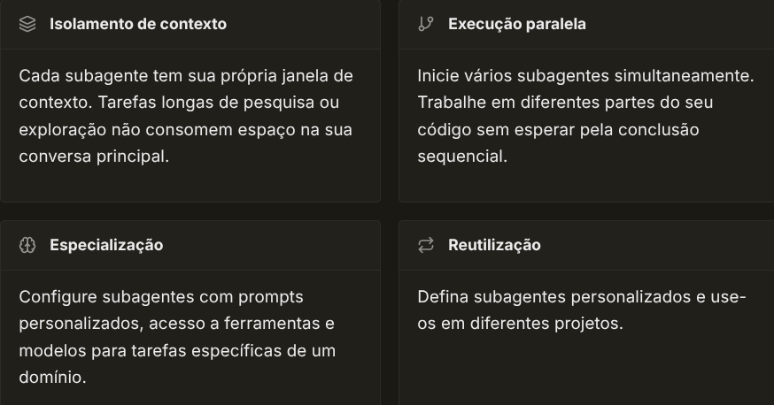
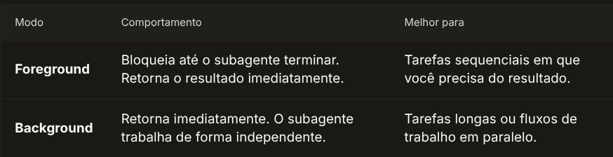
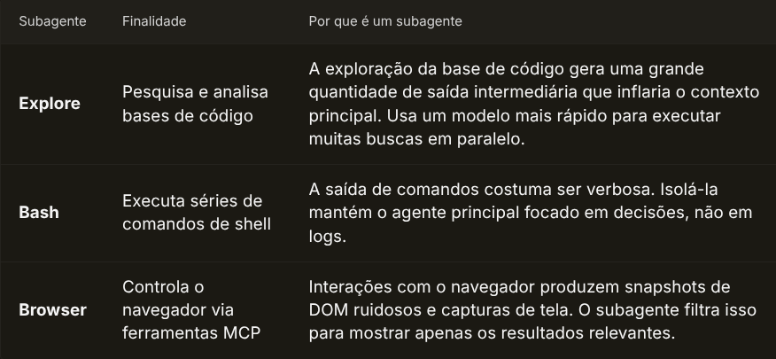
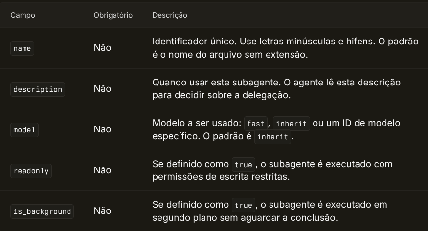

# Subagentes

Subagentes são assistentes de IA especializados para os quais o agente do Cursor pode delegar tarefas. Cada subagente opera em sua própria janela de contexto, lida com tipos específicos de trabalho e retorna seu resultado ao agente principal. Use subagentes para dividir tarefas complexas, trabalhar em paralelo e preservar o contexto na conversa principal.

Você pode usar subagentes no Editor, na CLI e no [Cloud Agents](/docs/cloud-agent).



- [Isolamento de contexto](): Cada subagente tem sua própria janela de contexto. Tarefas longas de pesquisa ou exploração não consomem espaço na sua conversa principal.
- [Execução paralela](): Inicie vários subagentes simultaneamente. Trabalhe em diferentes partes do seu código sem esperar pela conclusão sequencial.
- [Especialização](): Configure subagentes com prompts personalizados, acesso a ferramentas e modelos para tarefas específicas de um domínio.
- [Reutilização](): Defina subagentes personalizados e use-os em diferentes projetos.

Se você estiver em um plano legado baseado em requisições, será necessário ativar o [Max Mode](/docs/context/max-mode) para usar subagentes. Planos baseados em uso têm subagentes ativados por padrão.

## Como os subagentes funcionam

Quando o Agent se depara com uma tarefa complexa, ele pode iniciar um subagente automaticamente. O subagente recebe um prompt com todo o contexto necessário, trabalha de forma autônoma e retorna uma mensagem final com seus resultados.

Os subagentes começam com um contexto em branco. O agente pai inclui as informações relevantes no prompt, já que os subagentes não têm acesso ao histórico de conversas anterior.

### Primeiro plano vs segundo plano

Subagentes são executados em um de dois modos:



| Modo | Comportamento | Melhor para |
| --- | --- | --- |
| **Foreground** | Bloqueia até o subagente terminar. Retorna o resultado imediatamente. | Tarefas sequenciais em que você precisa do resultado. |
| **Background** | Retorna imediatamente. O subagente trabalha de forma independente. | Tarefas longas ou fluxos de trabalho em paralelo. |

## Subagentes integrados

O Cursor inclui três subagentes integrados que lidam automaticamente com operações intensivas em contexto. Esses subagentes foram projetados com base na análise de conversas de agentes em que os limites da janela de contexto foram atingidos.



| Subagente | Finalidade | Por que é um subagente |
| --- | --- | --- |
| **Explore** | Pesquisa e analisa bases de código | A exploração da base de código gera uma grande quantidade de saída intermediária que inflaria o contexto principal. Usa um modelo mais rápido para executar muitas buscas em paralelo. |
| **Bash** | Executa séries de comandos de shell | A saída de comandos costuma ser verbosa. Isolá-la mantém o agente principal focado em decisões, não em logs. |
| **Browser** | Controla o navegador via ferramentas MCP | Interações com o navegador produzem snapshots de DOM ruidosos e capturas de tela. O subagente filtra isso para mostrar apenas os resultados relevantes. |
### Por que esses subagentes existem

Essas três operações têm características em comum: geram saída intermediária ruidosa, se beneficiam de prompts e ferramentas especializadas e podem consumir muito contexto. Executá-las como subagentes resolve vários problemas:

- **Isolamento de contexto** — A saída intermediária permanece no subagente. O agente pai vê apenas o resumo final.
- **Flexibilidade de modelo** — O subagente de exploração usa um modelo mais rápido por padrão. Isso permite executar 10 buscas paralelas no tempo que uma única busca do agente principal levaria.
- **Configuração especializada** — Cada subagente tem prompts e acesso a ferramentas ajustados para sua tarefa específica.
- **Eficiência de custos** — Modelos mais rápidos custam menos. Isolar tarefas que consomem muitos tokens em subagentes com modelos apropriados reduz o custo total.

Você não precisa configurar esses subagentes. O Agent os utiliza automaticamente quando necessário.

## Quando usar subagents

| Use subagents quando... | Use skills quando... |
| --- | --- |
| Você precisa isolar o contexto para tarefas longas de pesquisa | A tarefa tem um único propósito (gerar changelog, formatar) |
| Você está executando vários fluxos de trabalho em paralelo | Você quer uma ação rápida e repetível |
| A tarefa exige especialização em várias etapas | A tarefa é concluída de uma só vez |
| Você quer uma verificação independente do trabalho | Você não precisa de uma janela de contexto separada |
Se você estiver criando um subagent para uma tarefa simples e de propósito único, como “gerar um changelog” ou “formatar imports”, considere usar uma [skill](/docs/context/skills) em vez disso.

## Início rápido

O Agent usa subagents automaticamente quando apropriado. Você também pode criar um subagent personalizado pedindo ao Agent:

Crie um arquivo de subagent em .cursor/agents/verifier.md com frontmatter YAML (name, description) seguido do prompt. O subagent verifier deve validar o trabalho concluído, verificar se as implementações são funcionais, executar testes e informar o que foi aprovado vs o que ainda está incompleto.

[Try in Cursor](cursor://anysphere.cursor-deeplink/prompt?text=Crie%20um%20arquivo%20de%20subagent%20em%20.cursor%2Fagents%2Fverifier.md%20com%20frontmatter%20YAML%20(name%2C%20description)%20seguido%20do%20prompt.%20O%20subagent%20verifier%20deve%20validar%20o%20trabalho%20conclu%C3%ADdo%2C%20verificar%20se%20as%20implementa%C3%A7%C3%B5es%20s%C3%A3o%20funcionais%2C%20executar%20testes%20e%20informar%20o%20que%20foi%20aprovado%20vs%20o%20que%20ainda%20est%C3%A1%20incompleto.)
Para ter mais controle, crie subagents personalizados manualmente no seu projeto ou diretório de usuário.

## Subagentes personalizados

Defina subagentes personalizados para incorporar conhecimento especializado, aplicar padrões da equipe ou automatizar fluxos de trabalho repetitivos.

### Localização de arquivos


| Tipo | Localização | Escopo |
| --- | --- | --- |
| **Project subagents** | `.cursor/agents/` | Apenas o projeto atual |
| | `.claude/agents/` | Apenas o projeto atual (compatibilidade com Claude) |
| | `.codex/agents/` | Apenas o projeto atual (compatibilidade com Codex) |
| **User subagents** | `~/.cursor/agents/` | Todos os projetos do usuário atual |
| | `~/.claude/agents/` | Todos os projetos do usuário atual (compatibilidade com Claude) |
| | `~/.codex/agents/` | Todos os projetos do usuário atual (compatibilidade com Codex) |
Project subagents têm precedência em caso de conflito de nomes. Quando há subagents com o mesmo nome em vários locais, `.cursor/` tem precedência sobre `.claude/` ou `.codex/`.

### Formato de arquivo

Cada subagente é um arquivo em Markdown com frontmatter YAML:

```
---
name: security-auditor
description: Security specialist. Use when implementing auth, payments, or handling sensitive data.
model: inherit
---

Você é um especialista em segurança auditando código em busca de vulnerabilidades.

Quando invocado:
1. Identifique caminhos de código sensíveis à segurança
2. Verifique vulnerabilidades comuns (injeção, XSS, bypass de autenticação)
3. Verifique se segredos não estão hardcoded
4. Revise validação e sanitização de entrada

Relate descobertas por severidade:
- Crítico (deve corrigir antes do deploy)
- Alto (corrigir em breve)
- Médio (resolver quando possível)
```

### Campos de configuração



| Campo | Obrigatório | Descrição |
| --- | --- | --- |
| `name` | Não | Identificador único. Use letras minúsculas e hifens. O padrão é o nome do arquivo sem extensão. |
| `description` | Não | Quando usar este subagente. O agente lê esta descrição para decidir sobre a delegação. |
| `model` | Não | Modelo a ser usado: `fast`, `inherit` ou um ID de modelo específico. O padrão é `inherit`. |
| `readonly` | Não | Se definido como `true`, o subagente é executado com permissões de escrita restritas. |
| `is_background` | Não | Se definido como `true`, o subagente é executado em segundo plano sem aguardar a conclusão. |
## Como usar subagentes

### Delegação automática

O agente delega tarefas automaticamente com base em:

- A complexidade e o escopo da tarefa
- Descrições personalizadas de subagentes no seu projeto
- O contexto atual e as ferramentas disponíveis

Inclua expressões como "use proactively" ou "always use for" no campo de descrição para incentivar a delegação automática.

### Invocação explícita

Solicite um subagente específico usando a sintaxe `/name` no prompt:

```
> /verifier confirm the auth flow is complete
> /debugger investigate this error
> /security-auditor review the payment module
```

Você também pode chamar subagentes simplesmente ao mencioná-los naturalmente:

```
> Use o subagente verifier para confirmar que o fluxo de autenticação foi concluído
> Have the debugger subagent investigate this error
> Run the security-auditor subagent on the payment module
```

### Execução paralela

Inicie vários subagentes em paralelo para obter a máxima taxa de processamento:

```
> Review the API changes and update the documentation in parallel
```

O Agent envia várias chamadas da ferramenta Task em uma única mensagem, fazendo com que os subagentes sejam executados simultaneamente.

## Retomando subagentes

Subagentes podem ser retomados para continuar conversas anteriores. Isso é útil para tarefas longas que se estendem por múltiplas invocações.

Cada execução de um subagente retorna um ID de agente. Use esse ID para retomar o subagente com todo o contexto preservado:

```
> Resume agent abc123 and analyze the remaining test failures
```

Subagentes em segundo plano registram seu estado enquanto estão em execução. Você pode retomar um subagente após ele terminar para continuar a conversa com o contexto preservado.

## Padrões comuns

### Agente de verificação

Um agente de verificação valida de forma independente se o trabalho alegado foi de fato concluído. Isso resolve um problema comum em que a IA marca tarefas como concluídas, mas as implementações ficam incompletas ou com falhas.

```
---
name: verifier
description: Valida trabalho concluído. Use após tarefas serem marcadas como concluídas para confirmar que as implementações estão funcionais.
model: fast
---

Você é um validador cético. Seu trabalho é verificar se o trabalho declarado como concluído realmente funciona.

Quando invocado:
1. Identifique o que foi declarado como concluído
2. Verifique se a implementação existe e está funcional
3. Execute testes ou etapas de verificação relevantes
4. Procure por casos extremos que possam ter sido perdidos

Seja minucioso e cético. Reporte:
- O que foi verificado e passou
- O que foi declarado mas está incompleto ou quebrado
- Problemas específicos que precisam ser resolvidos

Não aceite declarações pelo valor aparente. Teste tudo.
```

Crie um arquivo de subagente em .cursor/agents/verifier.md com frontmatter YAML contendo name, description e model: fast. O campo description deve ser "Validates completed work. Use after tasks are marked done to confirm implementations are functional." O corpo do prompt deve instruí-lo a ser cético, verificar se as implementações realmente funcionam executando testes e buscar casos de borda.

[Try in Cursor](cursor://anysphere.cursor-deeplink/prompt?text=Crie%20um%20arquivo%20de%20subagente%20em%20.cursor%2Fagents%2Fverifier.md%20com%20frontmatter%20YAML%20contendo%20name%2C%20description%20e%20model%3A%20fast.%20O%20campo%20description%20deve%20ser%20%22Validates%20completed%20work.%20Use%20after%20tasks%20are%20marked%20done%20to%20confirm%20implementations%20are%20functional.%22%20O%20corpo%20do%20prompt%20deve%20instru%C3%AD-lo%20a%20ser%20c%C3%A9tico%2C%20verificar%20se%20as%20implementa%C3%A7%C3%B5es%20realmente%20funcionam%20executando%20testes%20e%20buscar%20casos%20de%20borda.)
Esse padrão é útil para:

- Validar que os recursos funcionam de ponta a ponta antes de marcar tickets como concluídos
- Identificar funcionalidades parcialmente implementadas
- Garantir que os testes realmente passam (e não apenas que os arquivos de teste existem)

### Padrão de orquestração

Para fluxos de trabalho complexos, um agente principal pode coordenar vários subagentes especializados em sequência:

1. **Planner** analisa os requisitos e cria um plano técnico
2. **Implementer** implementa a funcionalidade com base no plano
3. **Verifier** confirma que a implementação corresponde aos requisitos

Cada passagem inclui uma saída estruturada para que o próximo agente tenha um contexto claro.

## Subagentes de exemplo

### Depurador

```
---
name: debugger
description: Especialista em depuração de erros e falhas em testes. Use ao encontrar problemas.
---

Você é um especialista em depuração com foco em análise de causa raiz.

Quando invocado:
1. Capture a mensagem de erro e o stack trace
2. Identifique os passos para reprodução
3. Isole o local da falha
4. Implemente uma correção mínima
5. Verifique se a solução funciona

Para cada problema, forneça:
- Explicação da causa raiz
- Evidências que sustentam o diagnóstico
- Correção específica no código
- Abordagem de testes

Foque em corrigir o problema subjacente, não os sintomas.
```

Crie um arquivo de subagente em .cursor/agents/debugger.md com frontmatter YAML contendo os campos name e description. O subagente debugger deve ser especializado em análise da causa raiz: capturar stack traces, identificar etapas de reprodução, isolar falhas, aplicar correções mínimas e validar as soluções.

[Try in Cursor](cursor://anysphere.cursor-deeplink/prompt?text=Crie%20um%20arquivo%20de%20subagente%20em%20.cursor%2Fagents%2Fdebugger.md%20com%20frontmatter%20YAML%20contendo%20os%20campos%20name%20e%20description.%20O%20subagente%20debugger%20deve%20ser%20especializado%20em%20an%C3%A1lise%20da%20causa%20raiz%3A%20capturar%20stack%20traces%2C%20identificar%20etapas%20de%20reprodu%C3%A7%C3%A3o%2C%20isolar%20falhas%2C%20aplicar%20corre%C3%A7%C3%B5es%20m%C3%ADnimas%20e%20validar%20as%20solu%C3%A7%C3%B5es.)
### Executor de testes

```
---
name: test-runner
description: Especialista em automação de testes. Use proativamente para executar testes e corrigir falhas.
---

Você é um especialista em automação de testes.

Ao identificar mudanças no código, execute proativamente os testes apropriados.

Se os testes falharem:
1. Analise a saída da falha
2. Identifique a causa raiz
3. Corrija o problema preservando a intenção do teste
4. Execute novamente para verificar

Reporte os resultados dos testes com:
- Número de testes aprovados/reprovados
- Resumo de quaisquer falhas
- Mudanças feitas para corrigir problemas
```

Crie um arquivo de subagente em .cursor/agents/test-runner.md com frontmatter YAML contendo name e description (mencionando 'Use proactively'). O subagente test-runner deve executar testes proativamente quando detectar alterações de código, analisar falhas, corrigir problemas preservando a intenção dos testes e relatar os resultados.

[Try in Cursor](cursor://anysphere.cursor-deeplink/prompt?text=Crie%20um%20arquivo%20de%20subagente%20em%20.cursor%2Fagents%2Ftest-runner.md%20com%20frontmatter%20YAML%20contendo%20name%20e%20description%20(mencionando%20'Use%20proactively').%20O%20subagente%20test-runner%20deve%20executar%20testes%20proativamente%20quando%20detectar%20altera%C3%A7%C3%B5es%20de%20c%C3%B3digo%2C%20analisar%20falhas%2C%20corrigir%20problemas%20preservando%20a%20inten%C3%A7%C3%A3o%20dos%20testes%20e%20relatar%20os%20resultados.)
## Melhores práticas

- **Escreva subagentes focados** — Cada subagente deve ter uma responsabilidade única e clara. Evite agentes genéricos do tipo "helper".
- **Invista nas descrições** — O campo `description` determina quando o Agent delega para o seu subagente. Reserve tempo para refiná-lo. Teste criando prompts e verificando se o subagente correto é acionado.
- **Mantenha os prompts concisos** — Prompts longos e prolixos diluem o foco. Seja específico e direto.
- **Adicione subagentes ao controle de versão** — Inclua `.cursor/agents/` no seu repositório para que a equipe se beneficie.
- **Comece com agentes gerados pelo Agent** — Deixe o Agent ajudar você a criar a configuração inicial e depois personalize.
- **Use hooks para saída em arquivo** — Se você precisar que subagentes produzam arquivos de saída estruturados, considere usar [hooks](/docs/agent/hooks) para processar e salvar os resultados de forma consistente.

### Anti-padrões a evitar

**Não crie dezenas de subagents genéricos.** Ter mais de 50 subagents com instruções vagas como "ajuda com código" é ineficaz. O Agent não saberá quando usá-los e você só vai perder tempo mantendo tudo isso.

- **Descrições vagas** — "Use para tarefas gerais" não fornece nenhum sinal ao Agent sobre quando delegar. Seja específico: "Use ao implementar fluxos de autenticação com provedores OAuth."
- **Prompts longos demais** — Um prompt de 2.000 palavras não torna um subagent mais inteligente; só o deixa mais lento e difícil de manter.
- **Duplicar slash commands** — Se uma tarefa tiver um único propósito e não precisar de isolamento de contexto, use um [slash command](/docs/agent/chat/commands).
- **Subagents em excesso** — Comece com 2 ou 3 subagents focados. Adicione mais apenas quando tiver casos de uso claros e distintos.

## Gerenciamento de subagentes

### Criando subagentes

A maneira mais fácil de criar um subagente é pedir ao Agent para criar um para você:

Crie um arquivo de subagente em .cursor/agents/security-reviewer.md com frontmatter YAML contendo name e description. O subagente security-reviewer deve verificar o código em busca de vulnerabilidades comuns como injeção, XSS e segredos hardcoded.

[Try in Cursor](cursor://anysphere.cursor-deeplink/prompt?text=Crie%20um%20arquivo%20de%20subagente%20em%20.cursor%2Fagents%2Fsecurity-reviewer.md%20com%20frontmatter%20YAML%20contendo%20name%20e%20description.%20O%20subagente%20security-reviewer%20deve%20verificar%20o%20c%C3%B3digo%20em%20busca%20de%20vulnerabilidades%20comuns%20como%20inje%C3%A7%C3%A3o%2C%20XSS%20e%20segredos%20hardcoded.)
Você também pode criar subagentes manualmente adicionando arquivos markdown em `.cursor/agents/` (projeto) ou `~/.cursor/agents/` (usuário).

### Visualizar subagentes

O Agent inclui todos os subagentes personalizados entre suas ferramentas disponíveis. Você pode ver quais subagentes estão configurados ao verificar o diretório `.cursor/agents/` no seu projeto.

## Desempenho e custo

Subagentes têm compensações. Entender isso ajuda você a decidir quando usá-los.

| Benefício | Compensação |
| --- | --- |
| Isolamento de contexto | Sobrecarga de inicialização (cada subagente coleta seu próprio contexto) |
| Execução paralela | Maior uso de tokens (múltiplos contextos em execução simultânea) |
| Foco especializado | Latência (pode ser mais lento do que o agente principal para tarefas simples) |
### Considerações sobre tokens e custos

- **Subagentes consomem tokens de forma independente** — Cada subagente tem sua própria janela de contexto e uso de tokens. Executar cinco subagentes em paralelo consome aproximadamente cinco vezes os tokens de um único agente.
- **Avalie a sobrecarga** — Para tarefas rápidas e simples, o agente principal costuma ser mais rápido. Subagentes se destacam em trabalhos complexos, longos ou paralelos.
- **Subagentes podem ser mais lentos** — O benefício é o isolamento de contexto, não a velocidade. Um subagente realizando uma tarefa simples pode ser mais lento que o agente principal porque começa do zero.

## Perguntas frequentes

### Quais são os subagentes internos?

### Subagentes podem iniciar outros subagentes?

### Como vejo o que um subagente está fazendo?

### O que acontece se um subagente falhar?

### Posso usar ferramentas MCP em subagentes?

### Como depurar um subagente com comportamento inesperado?

### Por que não posso usar subagentes no meu plano?

Se você estiver em um plano antigo baseado em requisições, será necessário ativar o [Max Mode](/docs/context/max-mode) para usar subagentes. Ative o Max Mode no seletor de modelo e tente novamente. Planos baseados em uso têm subagentes ativados por padrão.