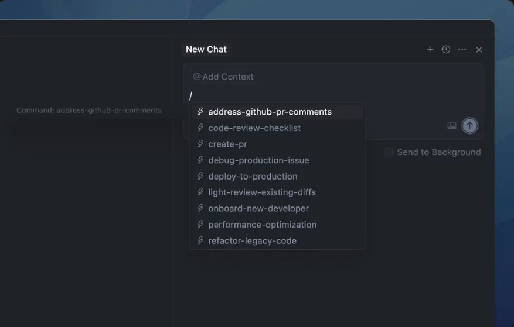

# Comandos

Comandos personalizados permitem criar fluxos de trabalho reutilizáveis que podem ser acionados com um simples prefixo `/` no campo de entrada do chat. Esses comandos ajudam a padronizar processos na sua equipe e tornam tarefas comuns mais eficientes.



No momento, os comandos estão em beta. O recurso e a sintaxe podem mudar conforme continuamos a aprimorá-los.

## Como os comandos funcionam

Comandos são definidos como arquivos Markdown simples que podem ser armazenados em três locais:

1. **Comandos de projeto**: Armazenados no diretório `.cursor/commands` do seu projeto
2. **Comandos globais**: Armazenados no diretório `~/.cursor/commands` no seu diretório home
3. **Comandos de equipe**: Criados por administradores de equipe no [Cursor Dashboard](https://cursor.com/dashboard?tab=team-content&section=commands) e automaticamente disponíveis para todos os membros da equipe

Quando você digita `/` na caixa de entrada do chat, o Cursor detecta e exibe automaticamente os comandos disponíveis de todos os locais, tornando-os instantaneamente acessíveis em todo o seu fluxo de trabalho.

## Criando comandos

1. Crie um diretório `.cursor/commands` na raiz do projeto
2. Adicione arquivos `.md` com nomes descritivos (por exemplo, `review-code.md`, `write-tests.md`)
3. Escreva conteúdo em Markdown puro descrevendo o que o comando deve fazer
4. Os comandos aparecerão automaticamente no chat quando você digitar `/`

Aqui está um exemplo de como a estrutura do diretório de comandos pode ficar:

```
.cursor/
└── commands/
    ├── address-github-pr-comments.md
    ├── code-review-checklist.md
    ├── create-pr.md
    ├── light-review-existing-diffs.md
    ├── onboard-new-developer.md
    ├── run-all-tests-and-fix.md
    ├── security-audit.md
    └── setup-new-feature.md
```

## Comandos de equipe

Comandos de equipe estão disponíveis nos planos Team e Enterprise.

Os administradores de equipe podem criar comandos personalizados, impostos pelo servidor, que ficam automaticamente disponíveis para todos os membros da equipe. Isso facilita o compartilhamento de prompts e fluxos de trabalho padronizados em toda a organização.

### Criando comandos de equipe

1. Acesse o [dashboard de Conteúdo da Equipe](https://cursor.com/dashboard?tab=team-content&section=commands)
2. Clique para criar um novo comando
3. Forneça:
- **Name**: o nome do comando que aparecerá após o prefixo `/`
- **Description** (opcional): contexto útil sobre o que o comando faz
- **Content**: o conteúdo em Markdown que define o comportamento do comando
4. Salve o comando

Depois de criado, o comando de equipe fica imediatamente disponível para todos os membros da equipe quando eles digitam `/` no campo de entrada do chat. Os membros da equipe não precisam sincronizar nem baixar nada manualmente — os comandos são sincronizados automaticamente.

### Benefícios dos comandos de equipe

- **Gestão centralizada**: Atualize os comandos uma vez e as alterações ficam disponíveis instantaneamente para todos os membros da equipe
- **Padronização**: Garanta que todos usem fluxos de trabalho consistentes e sigam as melhores práticas
- **Compartilhamento fácil**: Sem necessidade de distribuir arquivos ou coordenar atualizações na equipe
- **Controle de acesso**: Somente administradores da equipe podem criar e modificar comandos de equipe

## Parâmetros

Você pode fornecer contexto adicional para um comando na entrada de chat do Agent. Tudo o que você digitar após o nome do comando será incluído no prompt do modelo junto com o que você forneceu. Por exemplo:

```
/commit and /pr these changes to address DX-523
```

## Exemplos

Experimente estes comandos em seus projetos para entender melhor como funcionam.

### Checklist de revisão de código

```
# Checklist de Revisão de Código

## Visão Geral
Checklist abrangente para realizar revisões de código completas e garantir qualidade, segurança e manutenibilidade.

## Categorias de Revisão

### Funcionalidade
- [ ] O código faz o que deveria fazer
- [ ] Casos extremos são tratados
- [ ] O tratamento de erros é apropriado
- [ ] Sem bugs óbvios ou erros de lógica

### Qualidade do Código
- [ ] O código é legível e bem estruturado
- [ ] As funções são pequenas e focadas
- [ ] Os nomes das variáveis são descritivos
- [ ] Sem duplicação de código
- [ ] Segue as convenções do projeto

### Segurança
- [ ] Sem vulnerabilidades de segurança óbvias
- [ ] A validação de entrada está presente
- [ ] Dados sensíveis são tratados adequadamente
- [ ] Sem segredos hardcoded
```

### Auditoria de segurança

```
# Auditoria de Segurança

## Visão Geral
Realize uma auditoria de segurança abrangente na base de código, verificando vulnerabilidades comuns e práticas inseguras.

## Áreas de Verificação

### Autenticação e Autorização
- [ ] Tokens e sessões são gerenciados de forma segura
- [ ] Permissões são verificadas em todos os endpoints
- [ ] Senhas são armazenadas com hashing adequado

### Validação de Entrada
- [ ] Todas as entradas do usuário são validadas e sanitizadas
- [ ] Proteção contra injeção SQL/NoSQL
- [ ] Proteção contra XSS (Cross-Site Scripting)

### Dados Sensíveis
- [ ] Sem segredos hardcoded no código
- [ ] Variáveis de ambiente usadas para configurações sensíveis
- [ ] Dados sensíveis criptografados em trânsito e em repouso

### Dependências
- [ ] Sem dependências com vulnerabilidades conhecidas
- [ ] Versões de pacotes estão atualizadas
```

### Configurar nova funcionalidade

```
# Configurar Nova Funcionalidade

## Visão Geral
Configure a estrutura inicial para uma nova funcionalidade seguindo os padrões do projeto.

## Etapas
1. Criar branch a partir da branch principal
2. Criar estrutura de diretórios necessária
3. Configurar arquivos base (componentes, serviços, testes)
4. Adicionar rotas ou endpoints necessários
5. Criar testes unitários iniciais

## Checklist
- [ ] Branch criada com nome descritivo
- [ ] Estrutura de diretórios segue o padrão do projeto
- [ ] Arquivos base criados com boilerplate mínimo
- [ ] Testes iniciais configurados e passando
- [ ] Documentação atualizada se necessário
```

