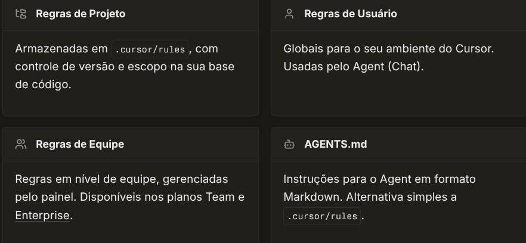
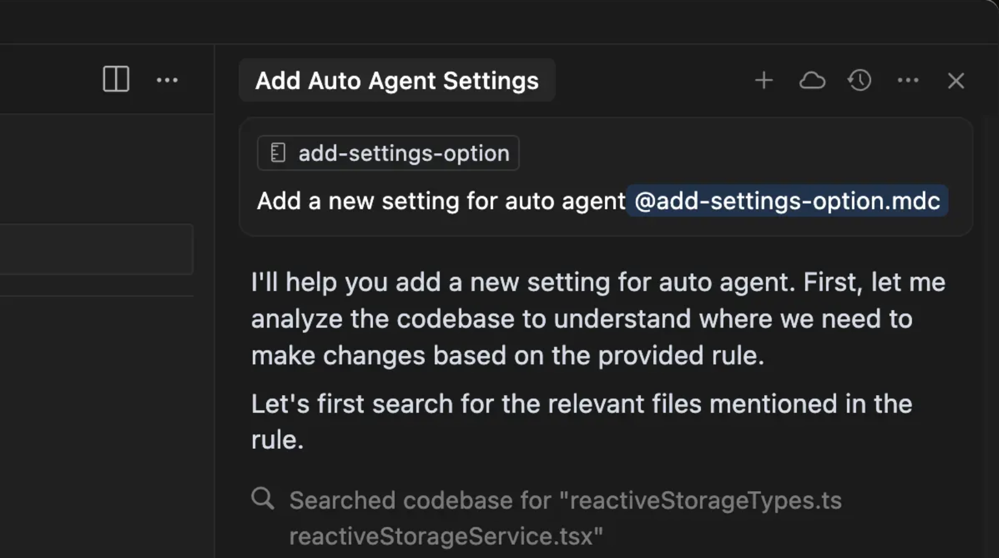
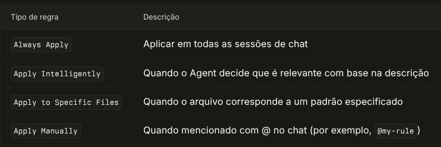
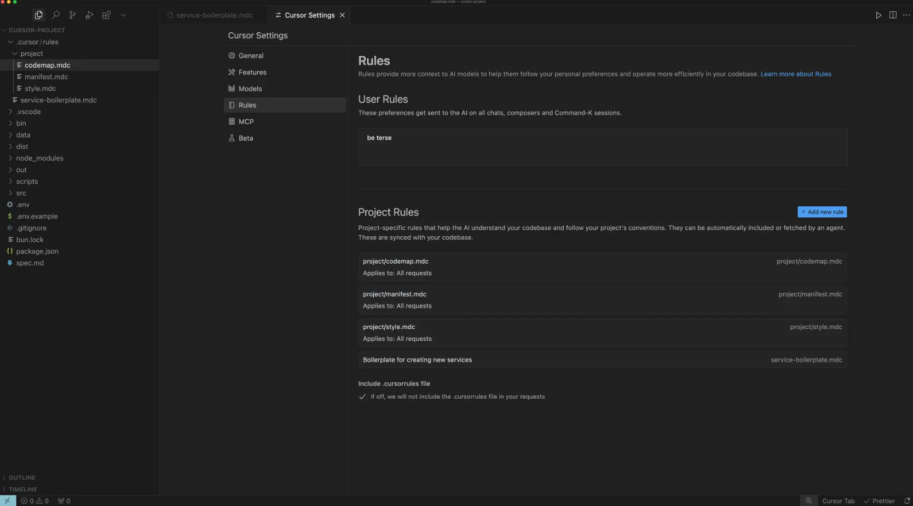
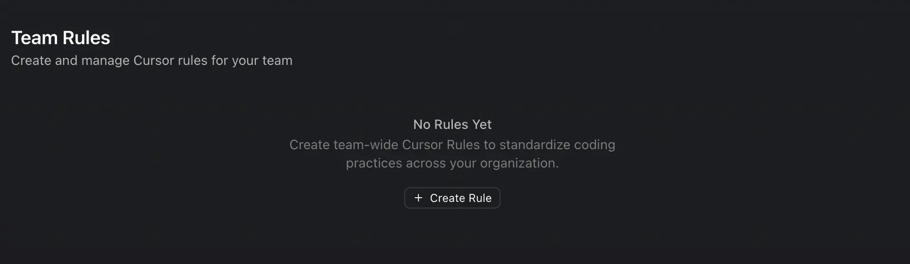

# Regras

As regras fornecem instruções em nível de sistema para o Agent. Elas agrupam prompts, scripts e outros recursos, facilitando o gerenciamento e o compartilhamento de fluxos de trabalho em toda a equipe.

O Cursor oferece suporte a quatro tipos de regras:




- [Regras de Projeto](): Armazenadas em .cursor/rules, com controle de versão e escopo na sua base de código.
- [Regras de Usuário](): Globais para o seu ambiente do Cursor. Usadas pelo Agent (Chat).
- [Regras de Equipe](): Regras em nível de equipe, gerenciadas pelo painel. Disponíveis nos planos Team e Enterprise.
- [AGENTS.md](): Instruções para o Agent em formato Markdown. Alternativa simples a
.cursor/rules.

## Como as regras funcionam

Modelos de linguagem de grande porte não mantêm memória entre respostas. As regras fornecem contexto persistente e reutilizável no nível do prompt.

Quando são aplicadas, o conteúdo das regras é incluído no início do contexto do modelo. Isso fornece à IA uma orientação consistente para gerar código, interpretar edições ou ajudar com fluxos de trabalho.




## Regras do projeto

As regras do projeto ficam em `.cursor/rules` como arquivos markdown e são versionadas no controle de versão. Elas são definidas usando padrões de caminho, acionadas manualmente ou incluídas com base na relevância.

Use regras do projeto para:

- Codificar conhecimento específico de domínio sobre sua base de código
- Automatizar fluxos de trabalho ou modelos específicos do projeto
- Padronizar decisões de estilo ou arquitetura

### Estrutura do arquivo de regra

Cada regra é um arquivo Markdown que você pode nomear como quiser. O Cursor oferece suporte às extensões `.md` e `.mdc`. Use arquivos `.mdc` com frontmatter para especificar `description` e `globs` e ter mais controle sobre quando as regras são aplicadas.

```
.cursor/rules/
  react-patterns.mdc       # Regra com frontmatter (description, globs)
  api-guidelines.md        # Regra markdown simples
  frontend/                # Organizar regras em pastas
    components.md
```

### Anatomia de uma regra

Cada regra é um arquivo markdown com metadados de frontmatter e conteúdo. Controle como as regras são aplicadas usando o menu de seleção de tipo, que altera as propriedades `description`, `globs`, `alwaysApply`.




Tipo de regra Descrição`Always Apply`Aplicar em todas as sessões de chat`Apply Intelligently`Quando o Agent decide que é relevante com base na descrição`Apply to Specific Files`Quando o arquivo corresponde a um padrão especificado`Apply Manually`Quando mencionado com @ no chat (por exemplo, `@my-rule`)
```
---
globs:
alwaysApply: false
---

- Use nosso padrão RPC interno ao definir serviços
- Sempre use snake_case para nomes de serviços.

@service-template.ts
```

### Criando uma regra

Crie regras usando o comando `New Cursor Rule` ou acessando `Cursor Settings > Rules, Commands`. Isso cria um novo arquivo de regra em `.cursor/rules`. Em `Settings`, você pode ver todas as regras e o status de cada uma.




## Boas práticas

Boas regras são focadas, práticas e têm escopo bem definido.

- Mantenha cada regra com menos de 500 linhas
- Divida regras grandes em múltiplas regras componíveis
- Forneça exemplos concretos ou arquivos de referência
- Evite orientações vagas. Escreva regras como se fossem documentação interna clara
- Reaproveite regras ao repetir prompts no chat
- Faça referência a arquivos em vez de copiar seu conteúdo — isso mantém as regras curtas e evita que fiquem desatualizadas conforme o código muda

### O que evitar nas rules

- **Copiar guias de estilo inteiros**: Use um linter em vez disso. O Agent já conhece convenções de estilo comuns.
- **Documentar todos os comandos possíveis**: O Agent conhece ferramentas comuns como npm, git e pytest.
- **Adicionar instruções para edge cases que raramente se aplicam**: Mantenha as rules focadas em padrões que você usa com frequência.
- **Duplicar o que já existe na sua base de código**: Aponte para exemplos canônicos em vez de copiar código.

Comece simples. Adicione rules apenas quando notar que o Agent comete o mesmo erro repetidamente. Não otimize demais antes de entender seus padrões.

Faça commit das suas rules no git para que todo o seu time se beneficie. Quando você vir o Agent cometer um erro, atualize a rule. Você pode até mencionar `@cursor` em uma issue ou PR do GitHub para que o Agent atualize a rule para você.

## Padrão Lean Rules + On-Demand Docs

### Problema

Rules que entram no contexto do modelo consomem tokens em **toda** mensagem. Se uma rule de frontend tem 150 linhas com exemplos completos de código, esses tokens são gastos mesmo quando a IA só precisa saber a convenção de nomenclatura.

### Solução

Separar em duas camadas:

```
.cursor/rules/frontend.md  →  Rule LEAN (~40 linhas): decisões + mapa de navegação
docs/patterns/frontend-patterns.md  →  Doc DETALHADO (~300 linhas): exemplos e snippets
```

**A rule lean** entra sempre no contexto (custo baixo). Ela contém:
- Stack declarada
- Decisões imperativas (SEMPRE/NUNCA)
- Convenções de nomenclatura
- **Tabela de "Consulta Sob Demanda"** → diz à IA ONDE buscar detalhes

**O pattern doc** só é lido quando a IA decide que precisa. Ele contém:
- Exemplos completos de código
- Padrões arquiteturais com snippets
- Explicações aprofundadas

### Como funciona na prática

1. Usuário abre um `.tsx` → Cursor carrega `frontend.md` (lean, ~40 linhas)
2. IA precisa criar um componente → Lê a tabela "Consulta Sob Demanda"
3. IA abre `docs/patterns/frontend-patterns.md#componentes` sob demanda
4. IA implementa seguindo o padrão detalhado

### Estrutura recomendada

```
project/
├── .cursor/rules/
│   ├── rules.md              # Regras globais (lean, alwaysApply: true)
│   ├── frontend.md           # Lean rule (~40 linhas)
│   └── backend.md            # Lean rule (~40 linhas)
├── docs/
│   └── patterns/
│       ├── frontend-patterns.md  # Referência detalhada (~300 linhas)
│       └── backend-patterns.md   # Referência detalhada (~300 linhas)
```

### Seção chave: Consulta Sob Demanda

A tabela de consulta sob demanda é o que torna o padrão funcional. Ela cria um **mapa de navegação** para a IA:

```markdown
## Consulta Sob Demanda

| Preciso de...                         | Consultar                                  |
|---------------------------------------|--------------------------------------------|
| Exemplos de componentes e composição  | `docs/patterns/frontend-patterns.md#componentes` |
| Padrões de estado e data fetching     | `docs/patterns/frontend-patterns.md#estado` |
| Padrões de testes                     | `docs/patterns/frontend-patterns.md#testes` |
| Exemplos canônicos do projeto         | `src/components/` e `src/pages/`           |
```

### Referências

Para exemplos completos do padrão Lean Rules:
- Template e documentação: `docs/templates/RULES-CURSOR-EX.md`
- Rule lean de frontend: `.cursor/rules/frontend.md`
- Rule lean de backend: `.cursor/rules/backend.md`
- Pattern doc de frontend: `docs/patterns/frontend-patterns.md`
- Pattern doc de backend: `docs/patterns/backend-patterns.md`

## Formato do arquivo de regra

Cada regra é um arquivo em markdown com metadados de *frontmatter* e conteúdo. Os metadados de *frontmatter* são usados para controlar como a regra será aplicada. O conteúdo corresponde à própria regra.

```
---
description: "This rule provides standards for frontend components and API validation"
alwaysApply: false
---

...rest of the rule content
```

Quando alwaysApply for verdadeiro, a regra será aplicada a todas as sessões de chat. Caso contrário, a descrição da regra será apresentada ao Cursor Agent, que decidirá se ela deve ser aplicada.

## Exemplos

### Padrões para componentes de frontend e validação de API

### Modelos para serviços Express e componentes React

### Automatizando fluxos de trabalho de desenvolvimento e geração de documentação

### Adicionando uma nova configuração no Cursor

Primeiro, crie uma propriedade para alternar em `@reactiveStorageTypes.ts`.

Adicione o valor padrão em `INIT_APPLICATION_USER_PERSISTENT_STORAGE` em `@reactiveStorageService.tsx`.

Para funcionalidades beta, adicione o toggle em `@settingsBetaTab.tsx`; caso contrário, adicione em `@settingsGeneralTab.tsx`. Toggles podem ser adicionados como `<SettingsSubSection>` para checkboxes gerais. Veja o restante do arquivo para exemplos.

```
<SettingsSubSection  label="Nome da sua funcionalidade"  description="Descrição da sua funcionalidade"  value={    vsContext.reactiveStorageService.applicationUserPersistentStorage      .myNewProperty ?? false  }  onChange={(newVal) => {    vsContext.reactiveStorageService.setApplicationUserPersistentStorage(      "myNewProperty",      newVal,    );  }}/>
```

Para usar no app, importe reactiveStorageService e use a propriedade:

```
const flagIsEnabled =  vsContext.reactiveStorageService.applicationUserPersistentStorage    .myNewProperty;
```

Exemplos estão disponíveis em provedores e frameworks. Regras contribuídas pela comunidade podem ser encontradas em coleções colaborativas e repositórios online.

## Regras de equipe

Os planos Team e [Enterprise](/docs/enterprise) podem criar e aplicar regras em toda a organização pelo [painel do Cursor](https://cursor.com/dashboard?tab=team-content). Administradores podem configurar se cada regra é obrigatória ou não para os membros da equipe.

As Regras de equipe funcionam em conjunto com outros tipos de regras e têm precedência para garantir que os padrões organizacionais sejam mantidos em todos os projetos. Elas oferecem uma forma poderosa de garantir padrões de código, práticas e fluxos de trabalho consistentes em toda a sua equipe, sem exigir configuração individual.

### Gerenciando regras da equipe

Administradores de equipe podem criar e gerenciar regras diretamente no painel do Cursor:



Depois que as regras da equipe são criadas, elas são aplicadas automaticamente a todos os membros e ficam visíveis no painel:

### Ativação e obrigatoriedade

- **Ativar esta regra imediatamente**: Quando selecionada, a regra entra em vigor assim que é criada. Quando desmarcada, a regra é salva como rascunho e só passa a valer quando você a ativa posteriormente.
- **Impor esta regra**: Quando ativada, a regra é obrigatória para todos os membros da equipe e não pode ser desativada nas configurações do Cursor. Quando não imposta, os membros da equipe podem desativar a regra em `Cursor Settings → Rules` na seção Team Rules.

Por padrão, Team Rules não impostas podem ser desativadas pelos usuários. Use **Impor esta regra** para evitar isso.

### Formato e como as Regras de Time são aplicadas

- **Texto simples**: Regras de Time são texto em formato livre. Elas não usam a estrutura de pastas das Regras de Projeto e não oferecem suporte a metadados como `globs`, `alwaysApply` ou tipos de regra.
- **Onde se aplicam**: Quando uma Regra de Time está ativa (e não desativada pelo usuário, a menos que seja obrigatória), ela é incluída no contexto do modelo para Agent (Chat) em todos os repositórios e projetos daquele time.
- **Precedência**: As regras são aplicadas nesta ordem: **Regras de Time → Regras de Projeto → Regras de Usuário**. Todas as regras aplicáveis são mescladas; fontes anteriores têm precedência quando houver conflito de orientações.

Alguns times usam regras obrigatórias como parte de processos internos de conformidade. Embora isso seja suportado, a orientação da IA não deve ser seu único controle de segurança.

## Importar regras

Você pode importar regras de fontes externas para reutilizar configurações existentes ou importar regras de outras ferramentas.

### Regras remotas (via GitHub)

Importe regras diretamente de qualquer repositório GitHub ao qual você tenha acesso — público ou privado.

1. Abra **Cursor Settings → Rules, Commands**
2. Clique em `+ Add Rule` ao lado de `Project Rules` e selecione Remote Rule (Github)
3. Cole a URL do repositório GitHub que contém a regra
4. O Cursor irá buscar e sincronizar a regra no seu projeto

As regras importadas permanecem sincronizadas com seu repositório de origem, assim atualizações na regra remota são refletidas automaticamente no seu projeto.

### Agent Skills

O Cursor pode carregar regras a partir de [Agent Skills](/docs/context/skills), um padrão aberto para estender agentes de IA com capacidades especializadas. Essas habilidades importadas são sempre aplicadas como regras decididas pelo agente, o que significa que o Cursor determina quando elas são relevantes com base no contexto.

Para ativar ou desativar Agent Skills:

1. Abra **Cursor Settings → Rules**
2. Encontre a seção **Import Settings**
3. Ative ou desative **Agent Skills**

Agent Skills são tratadas como regras decididas pelo agente e não podem ser configuradas como regras sempre aplicadas ou manuais.

## AGENTS.md

`AGENTS.md` é um arquivo markdown simples para definir instruções de agentes. Coloque-o na raiz do seu projeto como alternativa a `.cursor/rules` para casos de uso simples.

Ao contrário de Project Rules, `AGENTS.md` é um arquivo markdown puro, sem metadados ou configurações complexas. É perfeito para projetos que precisam de instruções simples e legíveis, sem a sobrecarga de regras estruturadas.

O Cursor é compatível com AGENTS.md na raiz do projeto e em subdiretórios.

```
# Project Instructions

## Code Style

- Use TypeScript for all new files
- Prefer functional components in React
- Use snake_case for database columns

## Architecture

- Follow the repository pattern
- Keep business logic in service layers
```

### Melhorias

### Suporte a AGENTS.md aninhados

O suporte a `AGENTS.md` aninhados em subdiretórios agora está disponível. Você pode colocar arquivos `AGENTS.md` em qualquer subdiretório do seu projeto, e eles serão aplicados automaticamente ao trabalhar com arquivos nesse diretório ou em seus subdiretórios.

Isso permite um controle mais granular das instruções do agente com base na área da base de código em que você está trabalhando:

```
project/
  AGENTS.md              # Instruções globais
  frontend/
    AGENTS.md            # Instruções específicas do frontend
    components/
      AGENTS.md          # Instruções específicas de componentes
  backend/
    AGENTS.md            # Instruções específicas do backend
```

As instruções de arquivos `AGENTS.md` aninhados são combinadas com as dos diretórios pai, e instruções mais específicas têm precedência.

## Regras do Usuário

As Regras do Usuário são preferências globais definidas em **Cursor Settings → Rules** que se aplicam a todos os projetos. Elas são utilizadas pelo Agent (Chat) e são ideais para definir o estilo de comunicação preferido e as convenções de código:

```
Responda de forma concisa. Evite repetições desnecessárias ou linguagem de preenchimento.
```

## Regras legadas do Cursor

### .cursorrules

O arquivo `.cursorrules` (legado) na raiz do projeto ainda é compatível, mas **será descontinuado**. Recomendamos migrar para o Project Rules ou para o arquivo `AGENTS.md`.

## FAQ

### Por que minha regra não está sendo aplicada?

### Regras podem referenciar outras regras ou arquivos?

### Posso criar uma regra a partir do chat?

### As regras afetam o Cursor Tab ou outros recursos de IA?

### As User Rules são aplicadas ao Inline Edit (Cmd/Ctrl+K)?

Não. As User Rules não são aplicadas ao Inline Edit (Cmd/Ctrl+K). Elas são
usadas apenas pelo Agent (Chat).