# Busca semântica

A busca semântica encontra código ao entender o seu significado, não apenas por correspondência de texto. Faça perguntas em linguagem natural como "onde a autenticação é tratada?" e obtenha resultados relevantes em toda a sua base de código.

## Como funciona

Cursor transforma seu código em vetores pesquisáveis por meio de um processo em 7 etapas:

1. Os arquivos do seu workspace são sincronizados com segurança com os servidores do Cursor para manter o índice sempre atualizado.
2. Os arquivos são divididos em trechos significativos que capturam a essência do seu código — funções, classes e blocos lógicos de código, em vez de segmentos de texto arbitrários.
3. Cada trecho é convertido em uma representação vetorial usando modelos de IA. Isso cria uma impressão digital matemática que captura o significado semântico do seu código.
4. Esses embeddings são armazenados em um banco de dados vetorial especializado, otimizado para busca rápida por similaridade em milhões de trechos de código.
5. Quando você faz uma pesquisa, sua consulta é convertida em um vetor usando os mesmos modelos de IA que processaram seu código.
6. O sistema encontra os trechos de código mais semelhantes comparando o vetor da sua consulta com os embeddings armazenados.
7. Você recebe trechos de código relevantes com localização de arquivo e contexto, classificados por similaridade semântica à sua busca.

```mermaid
graph LR
    Root["🎨 .mermaid-diagram svg<br/><br/>Elemento Raiz<br/>dos Diagramas Mermaid"]
    
    subgraph Nodes["🔷 ELEMENTOS DE NÓS (.node)"]
        direction TB
        NodeParent["Seletor: .node<br/>───────────────"]
        Rect["📦 rect<br/>━━━━━━━<br/>🖊️ stroke: var(--border)<br/>🎨 fill: var(--secondary)"]
        Circle["⚪ circle<br/>━━━━━━━<br/>🖊️ stroke: var(--border)<br/>🎨 fill: var(--secondary)"]
        Ellipse["🔵 ellipse<br/>━━━━━━━<br/>🖊️ stroke: var(--border)<br/>🎨 fill: var(--secondary)"]
        Polygon["🔶 polygon<br/>━━━━━━━<br/>🖊️ stroke: var(--border)<br/>🎨 fill: var(--secondary)"]
        PathNode["📍 path<br/>━━━━━━━<br/>🖊️ stroke: var(--border)<br/>🎨 fill: var(--secondary)"]
        
        NodeParent --> Rect
        NodeParent --> Circle
        NodeParent --> Ellipse
        NodeParent --> Polygon
        NodeParent --> PathNode
    end
    
    subgraph Labels["📝 ELEMENTOS DE TEXTO"]
        direction TB
        LabelParent["Seletor: .label<br/>───────────────"]
        Text["📄 text<br/>━━━━━━━<br/>🎨 fill: var(--foreground)<br/>🖍️ color: var(--foreground)"]
        Span["📋 span<br/>━━━━━━━<br/>🎨 fill: var(--foreground)<br/>🖍️ color: var(--foreground)"]
        
        LabelParent --> Text
        LabelParent --> Span
    end
    
    subgraph Edges["🔗 ELEMENTOS DE CONEXÃO"]
        direction TB
        EdgeParent["Seletor: .edgePath<br/>───────────────"]
        PathEdge["➡️ .path<br/>━━━━━━━<br/>🖊️ stroke: var(--border)"]
        FlowLink["🔀 .flowchart-link<br/>━━━━━━━<br/>🖊️ stroke: var(--border)"]
        
        EdgeParent --> PathEdge
        EdgeParent --> FlowLink
    end
    
    subgraph Arrows["🎯 ELEMENTOS DE SETAS E MARCADORES"]
        direction TB
        ArrowHead["▶️ .arrowheadPath<br/>━━━━━━━<br/>🎨 fill: var(--border)"]
        Marker["📌 .marker<br/>━━━━━━━<br/>🎨 fill: var(--border)<br/>🖊️ stroke: var(--border)"]
    end
    
    Root ==> |contém| Nodes
    Root ==> |contém| Labels
    Root ==> |contém| Edges
    Root ==> |contém| Arrows
    
    style Root fill:#1e40af,stroke:#1e3a8a,color:#fff,stroke-width:4px
    style NodeParent fill:#8b5cf6,stroke:#7c3aed,color:#fff,stroke-width:3px
    style LabelParent fill:#8b5cf6,stroke:#7c3aed,color:#fff,stroke-width:3px
    style EdgeParent fill:#8b5cf6,stroke:#7c3aed,color:#fff,stroke-width:3px
    
    style Rect fill:#dbeafe,stroke:#3b82f6,color:#1e40af,stroke-width:2px
    style Circle fill:#dbeafe,stroke:#3b82f6,color:#1e40af,stroke-width:2px
    style Ellipse fill:#dbeafe,stroke:#3b82f6,color:#1e40af,stroke-width:2px
    style Polygon fill:#dbeafe,stroke:#3b82f6,color:#1e40af,stroke-width:2px
    style PathNode fill:#dbeafe,stroke:#3b82f6,color:#1e40af,stroke-width:2px
    
    style Text fill:#fef3c7,stroke:#f59e0b,color:#92400e,stroke-width:2px
    style Span fill:#fef3c7,stroke:#f59e0b,color:#92400e,stroke-width:2px
    
    style PathEdge fill:#d1fae5,stroke:#10b981,color:#065f46,stroke-width:2px
    style FlowLink fill:#d1fae5,stroke:#10b981,color:#065f46,stroke-width:2px
    
    style ArrowHead fill:#fce7f3,stroke:#ec4899,color:#831843,stroke-width:2px
    style Marker fill:#fce7f3,stroke:#ec4899,color:#831843,stroke-width:2px
    
    style Nodes fill:#f0f9ff,stroke:#3b82f6,stroke-width:3px
    style Labels fill:#fffbeb,stroke:#f59e0b,stroke-width:3px
    style Edges fill:#ecfdf5,stroke:#10b981,stroke-width:3px
    style Arrows fill:#fdf2f8,stroke:#ec4899,stroke-width:3px
```

        
## Por que usar busca semântica?

Embora ferramentas como `grep` e `ripgrep` sejam úteis para encontrar ocorrências exatas de texto, a busca semântica vai além ao entender o significado por trás do seu código.

Se você pedir ao Agent para "atualizar a navegação superior", a busca semântica pode encontrar `header.tsx` mesmo que a palavra "navigation" não apareça no nome do arquivo. Isso funciona porque as embeddings entendem que "header" e "top navigation" são semanticamente relacionados.

### Benefícios em relação ao uso isolado do grep

A busca semântica oferece várias vantagens:

- **Resultados mais rápidos**: O processamento acontece durante a indexação (offline), e não em tempo de execução, então as buscas do Agent são mais rápidas e baratas
- **Maior precisão**: Modelos personalizados recuperam resultados mais relevantes do que a simples correspondência de strings
- **Menos interações de acompanhamento**: Usuários enviam menos mensagens de esclarecimento e consomem menos tokens em comparação com a busca somente com grep
- **Correspondência conceitual**: Encontre código pelo que ele faz, não apenas pelo nome

Agent usa **tanto** grep quanto busca semântica em conjunto. Grep é excelente para encontrar
padrões exatos, enquanto a busca semântica é excelente para encontrar código
conceitualmente semelhante. Essa combinação entrega os melhores resultados.

## Primeiros passos

### Indexação inicial

A indexação começa automaticamente quando você abre um workspace. O sistema analisa a estrutura do workspace, envia os arquivos com segurança e os processa em modelos de IA para criar embeddings. **A busca semântica fica disponível quando 80% da indexação for concluída.**

## Mantendo o índice atualizado

### Sincronização automática

O Cursor mantém seu índice sincronizado automaticamente com seu workspace por meio de verificações periódicas a cada 5 minutos. O sistema atualiza de forma inteligente apenas os arquivos alterados, removendo embeddings antigos e criando novos conforme necessário. Os arquivos são processados em lotes para melhor desempenho, com impacto mínimo no seu fluxo de desenvolvimento.

### O que é indexado

Tipo de arquivoAçãoArquivos novosAdicionados automaticamente ao índiceArquivos modificadosEmbeddings antigos são removidos e novos são criadosArquivos excluídosRemovidos prontamente do índiceArquivos grandes ou complexosPodem ser ignorados para melhorar o desempenho
### Desempenho e solução de problemas

**Desempenho**: Usa agrupamento inteligente e cache para resultados precisos e atualizados.

**Etapas de solução de problemas**:

1. Verifique a conexão com a internet
2. Verifique as permissões do espaço de trabalho
3. Reinicie o Cursor
4. Entre em contato com o suporte se os problemas persistirem

O sistema de indexação funciona de forma confiável em segundo plano para manter seu código pesquisável.

## Privacidade e segurança

### Proteção de dados

A privacidade do seu código é protegida por múltiplas camadas de segurança. Os caminhos de arquivos são criptografados antes de serem enviados para nossos servidores, garantindo que a estrutura do seu projeto permaneça confidencial. O conteúdo do seu código nunca é armazenado em texto simples em nossos servidores, preservando a confidencialidade da sua propriedade intelectual. O código é mantido apenas em memória durante o processo de indexação e, em seguida, descartado, portanto não há armazenamento permanente do seu código-fonte.

## Configuração

Cursor indexa todos os arquivos, exceto aqueles em [arquivos de exclusão](/docs/context/ignore-files) (por exemplo, `.gitignore`, `.cursorignore`).

Clique em `Show Settings` para:

- Ativar indexação automática para novos repositórios
- Configurar quais arquivos ignorar

[Ignorar grandes arquivos de conteúdo](/docs/context/ignore-files) melhora a
precisão das respostas.

### Exibir arquivos indexados

Para ver os caminhos dos arquivos indexados: `Cursor Settings` > `Indexing & Docs` > `View included files`

Isso abre um arquivo `.txt` com a lista de todos os arquivos indexados.

## FAQ

### Onde posso ver todas as codebases indexadas?

### Como excluo todas as codebases indexadas?

### Por quanto tempo as codebases indexadas são mantidas?

### Meu código-fonte é armazenado nos servidores do Cursor?

### Posso personalizar a criptografia de paths?

### Como funciona o compartilhamento em equipe?

### O que é smart index copying?

### O Cursor oferece suporte a workspaces multi-root?

Sim. O Editor do Cursor oferece suporte a [multi-root workspaces](https://code.visualstudio.com/docs/editor/workspaces#_multiroot-workspaces), permitindo que você trabalhe com múltiplas codebases:

- Todas as codebases são indexadas automaticamente
- O contexto de cada codebase fica disponível para a IA
- `.cursor/rules` funciona em todas as pastas
- Alguns recursos que dependem de um único git root, como worktrees, são desativados para workspaces multi-root.

Cursor Cloud Agents não oferecem suporte a workspaces multi-root.