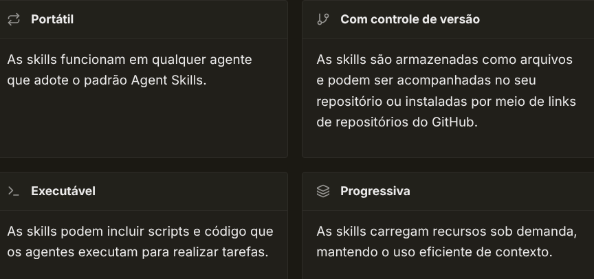
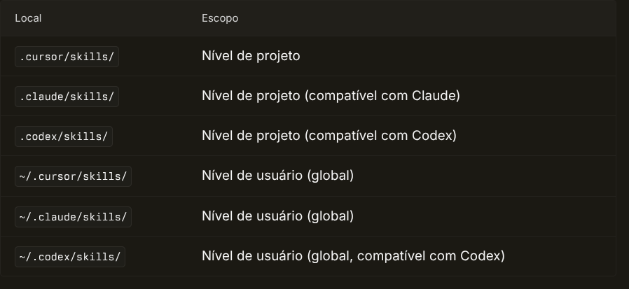
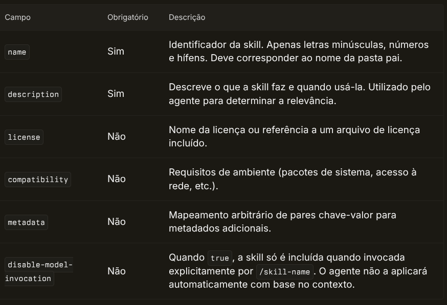
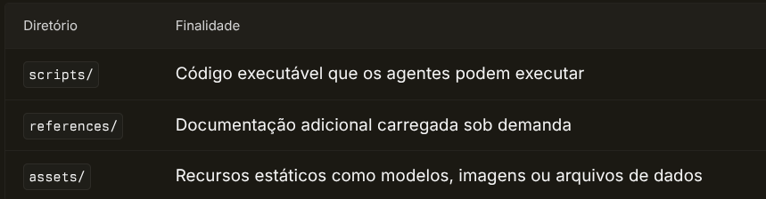

# Skills de Agentes

Skills de Agentes é um padrão aberto que permite estender agentes de IA com capacidades especializadas. Skills encapsulam conhecimento e fluxos de trabalho específicos de um domínio que os agentes podem usar para executar tarefas específicas.

## O que são skills?

Uma skill é um pacote portátil e versionado que ensina agentes a executar tarefas específicas de um domínio. As skills podem incluir tanto instruções quanto scripts ou código executável que os agentes podem executar.



- [Portátil](): As skills funcionam em qualquer agente que adote o padrão Agent Skills.
- [Com controle de versão](): As skills são armazenadas como arquivos e podem ser acompanhadas no seu repositório ou instaladas por meio de links de repositórios do GitHub.
- [Executável](): As skills podem incluir scripts e código que os agentes executam para realizar tarefas.
- [Progressiva](): As skills carregam recursos sob demanda, mantendo o uso eficiente de contexto.

## Como as skills funcionam

Quando o Cursor inicia, ele descobre automaticamente as skills nos diretórios de skills e as disponibiliza para o Agent. O Agent é apresentado às skills disponíveis e decide quando elas são relevantes com base no contexto.

As skills também podem ser chamadas manualmente digitando `/` no chat do Agent e procurando pelo nome da skill.

## Diretórios de skills

As skills são carregadas automaticamente destes locais:



LocalEscopo`.cursor/skills/`Nível de projeto`.claude/skills/`Nível de projeto (compatível com Claude)`.codex/skills/`Nível de projeto (compatível com Codex)`~/.cursor/skills/`Nível de usuário (global)`~/.claude/skills/`Nível de usuário (global)`~/.codex/skills/`Nível de usuário (global, compatível com Codex)
Cada skill deve ser uma pasta contendo um arquivo `SKILL.md`:

```
.cursor/
└── skills/
    └── my-skill/
        └── SKILL.md
```

As skills também podem incluir diretórios opcionais para scripts, referências e recursos:

```
.cursor/
└── skills/
    └── deploy-app/
        ├── SKILL.md
        ├── scripts/
        │   ├── deploy.sh
        │   └── validate.py
        ├── references/
        │   └── REFERENCE.md
        └── assets/
            └── config-template.json
```

## Formato do arquivo SKILL.md

Cada skill é definida em um arquivo `SKILL.md` com frontmatter YAML:

```
---
name: my-skill
description: Short description of what this skill does and when to use it.
---

# My Skill

Detailed instructions for the agent.

## When to Use

- Use this skill when...
- This skill is helpful for...

## Instructions

- Step-by-step guidance for the agent
- Domain-specific conventions
- Best practices and patterns
- Use the ask questions tool if you need to clarify requirements with the user
```

### Campos de frontmatter



CampoObrigatórioDescrição`name`SimIdentificador da skill. Apenas letras minúsculas, números e hífens. Deve corresponder ao nome da pasta pai.`description`SimDescreve o que a skill faz e quando usá-la. Utilizado pelo agente para determinar a relevância.`license`NãoNome da licença ou referência a um arquivo de licença incluído.`compatibility`NãoRequisitos de ambiente (pacotes de sistema, acesso à rede, etc.).`metadata`NãoMapeamento arbitrário de pares chave-valor para metadados adicionais.`disable-model-invocation`NãoQuando `true`, a skill só é incluída quando invocada explicitamente por `/skill-name`. O agente não a aplicará automaticamente com base no contexto.

## Desativando a invocação automática

Por padrão, as skills são aplicadas automaticamente quando o agente determina que são relevantes. Defina `disable-model-invocation: true` para que uma skill se comporte como um comando com barra tradicional, sendo incluída no contexto apenas quando você digitar explicitamente `/skill-name` no chat.

## Incluindo scripts em skills

As skills podem incluir um diretório `scripts/` contendo código executável que os agents podem executar. Faça referência aos scripts no seu arquivo `SKILL.md` usando caminhos relativos a partir da raiz da skill.

```
---
name: deploy-app
description: Implanta a aplicação nos ambientes de staging ou produção. Use ao implantar código ou quando o usuário mencionar deployment, releases ou ambientes.
---

# Deploy App

Deploy the application using the provided scripts.

## Usage

Run the deployment script: `scripts/deploy.sh <environment>`

Where `<environment>` is either `staging` or `production`.

## Pre-deployment Validation

Before deploying, run the validation script: `python scripts/validate.py`
```

O agente lê essas instruções e executa os scripts referenciados quando a skill é invocada. Os scripts podem ser escritos em qualquer linguagem — Bash, Python, JavaScript ou qualquer outro formato executável compatível com a implementação do agente.

Os scripts devem ser autossuficientes, incluir mensagens de erro úteis e tratar casos de borda de forma adequada.

## Diretórios opcionais

As skills dão suporte a estes diretórios opcionais:



DiretórioFinalidade`scripts/`Código executável que os agentes podem executar`references/`Documentação adicional carregada sob demanda`assets/`Recursos estáticos como modelos, imagens ou arquivos de dados
Mantenha seu `SKILL.md` principal enxuto e mova o material de referência detalhado para arquivos separados. Isso mantém o uso de contexto eficiente, já que os agentes carregam recursos de forma progressiva — apenas quando necessário.

## Visualizando skills

Para visualizar as skills descobertas:

1. Abra as **Configurações do Cursor** (Cmd+Shift+J no Mac, Ctrl+Shift+J no Windows/Linux)
2. Acesse **Rules**
3. As skills são exibidas na seção **Agent Decides**

## Instalando skills do GitHub

Você pode importar skills de repositórios no GitHub:

1. Abra **Cursor Settings → Rules**
2. Na seção **Project Rules**, clique em **Add Rule**
3. Selecione **Remote Rule (Github)**
4. Insira a URL do repositório do GitHub

## Migrando regras e comandos para skills

O Cursor inclui, na versão 2.4, a skill integrada `/migrate-to-skills`, que ajuda você a converter regras dinâmicas existentes e slash commands em skills.

A skill de migração converte:

- **Regras dinâmicas**: Regras que usam a configuração "Apply Intelligently" — regras com `alwaysApply: false` (ou indefinido) e sem padrões `globs` definidos. Essas são convertidas em skills padrão.
- **Slash commands**: Tanto comandos em nível de usuário quanto em nível de workspace são convertidos em skills com `disable-model-invocation: true`, preservando seu comportamento de invocação explícita.

Para migrar:

1. Digite `/migrate-to-skills` no chat do Agent
2. O Agent vai identificar regras e comandos elegíveis e convertê-los em skills
3. Revise as skills geradas em `.cursor/skills/`

Regras com `alwaysApply: true` ou padrões `globs` específicos não são migradas, pois têm condições de disparo explícitas que diferem do comportamento de skills. Regras de usuário também não são migradas, pois não são armazenadas no sistema de arquivos.

## Saiba mais

Agent Skills é um padrão aberto. Saiba mais em [agentskills.io](https://agentskills.io).