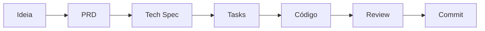

# WorkFlow - AI-Assisted Development Framework


Um framework para desenvolvimento assistido por IA seguindo a metodologia **Spec-Driven Development (SDD)**.

## O que é Spec-Driven Development?

**Pensar antes de digitar.** A IA funciona melhor com especificações do que com improviso.



## Quick Start

### 1. Crie uma Tech Spec
```
/create-techspec minha-feature
```

### 2. Gere as Tasks
```
/create-task minha-feature
```

### 3. Execute as Tasks
```
/execute-task minha-feature 01
```

## Estrutura do Projeto

```
WorkFlow/
├── .claude/
│   ├── agents/           # Agentes especializados
│   │   ├── tech-spec-writer.md
│   │   ├── tasks-writer.md
│   │   ├── code-quality-reviewer.md
│   │   └── conventional-commit-writer.md
│   └── commands/         # Comandos do workflow
│       ├── create-techspec.md
│       ├── create-task.md
│       ├── execute-task.md
│       └── execute-feature-task.md
├── docs/
│   ├── templates/        # Templates reutilizáveis
│   │   ├── techspec.md
│   │   ├── tasks.md
│   │   └── task.md
│   ├── tasks/            # Features em desenvolvimento
│   │   └── {feature-slug}/
│   ├── guiabasico.md     # Guia de uso
│   ├── workflow.md       # Diagrama do fluxo
│   └── spec-driven-development.md
└── README.md
```

## Agentes Disponíveis

| Agente | Descrição |
|--------|-----------|
| `@tech-spec-writer` | Cria especificações técnicas detalhadas |
| `@tasks-writer` | Gera lista de tarefas a partir da Tech Spec |
| `@code-quality-reviewer` | Revisa código e aplica correções |
| `@conventional-commit-writer` | Cria commits seguindo Conventional Commits |

## Comandos Disponíveis

| Comando | Descrição |
|---------|-----------|
| `/create-techspec {slug}` | Cria uma Tech Spec para uma feature |
| `/create-task {slug}` | Gera tasks a partir da Tech Spec |
| `/execute-task {slug} {num}` | Executa uma task específica |
| `/execute-feature-task {slug}` | Executa todas as tasks de uma feature |

## Configuração Inicial

### 1. Configure o CLAUDE.md

O arquivo `CLAUDE.md` é lido automaticamente pelo Claude e contém as instruções do projeto:

```bash
# Use o template como base
cp CLAUDE.md seu-projeto/CLAUDE.md

# Edite e adapte para seu projeto:
# - Defina a persona do assistente
# - Configure a stack tecnológica
# - Adicione regras específicas
# - Contextualize o projeto
```

📝 **Veja o exemplo completo:** [CLAUDE-example.md](docs/templates/CLAUDE-example.md)

## Documentação

- [CLAUDE.md](CLAUDE.md) - Template de configuração para Claude
- [Guia Básico](docs/guiabasico.md) - Como usar o workflow
- [Spec-Driven Development](docs/spec-driven-development.md) - Conceitos do SDD
- [Fluxo de Trabalho](docs/workflow.md) - Diagrama visual do processo

## Por que usar este workflow?

1. **Contexto para a IA** - Especificações claras geram código melhor
2. **Economia de tokens** - Agentes especializados com contexto separado
3. **Consistência** - Templates padronizados para toda equipe
4. **Rastreabilidade** - Histórico completo de decisões técnicas
5. **Qualidade** - Review automatizado e commits padronizados

## Licença

MIT
