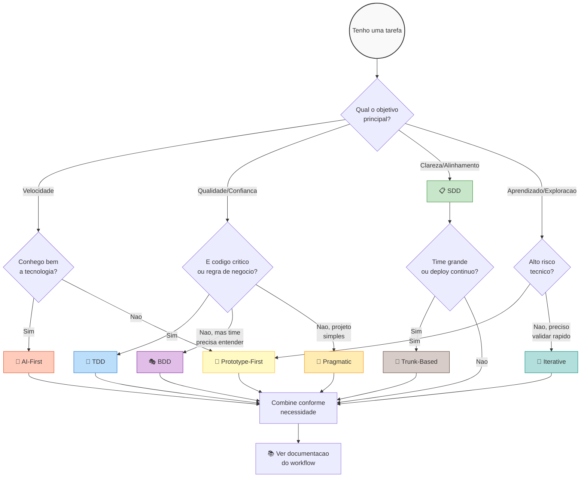

# WorkFlow - AI-Assisted Development Framework


Um framework completo de workflows para desenvolvimento assistido por IA. **Escolha o workflow certo para cada tarefa.**

## Qual Workflow Devo Usar?

> **"Workflow nao e religiao. E ferramenta cognitiva."**

Use o fluxograma abaixo para encontrar o workflow ideal:



### Resumo Rapido

| Objetivo | Workflow | Quando Usar |
|----------|----------|-------------|
| 🚀 **Velocidade** | [AI-First](docs/workflows/ai-first-prompt-driven.md) | IA + specs claras + revisao humana |
| 📋 **Clareza** | [SDD](docs/workflows/spec-driven-development.md) | Especificar antes de codar |
| 🧪 **Confianca** | [TDD](docs/workflows/test-driven-development.md) | Teste antes, codigo depois |
| 🎭 **Comunicacao** | [BDD](docs/workflows/behavior-driven-development.md) | Linguagem natural para specs |
| 🔬 **Exploracao** | [Prototype-First](docs/workflows/prototype-first-spike-driven.md) | Validar tecnologia nova |
| 🔄 **Validacao** | [Iterative](docs/workflows/iterative-incremental-development.md) | MVP + feedback + ajuste |
| 🌳 **Deploy Continuo** | [Trunk-Based](docs/workflows/trunk-based-development.md) | Branches curtas, CI/CD |
| 🎯 **Flexibilidade** | [Pragmatic](docs/workflows/pragmatic-opportunistic.md) | Adaptar conforme situacao |

> 📖 **Guia completo**: [Mapa de Workflows](docs/workflows/work-flows.md) | [Como Escolher](docs/workflow.md)

---

## Quick Start

### 1. Escolha seu Workflow

```bash
# Leia o guia de escolha
cat docs/workflow.md
```

### 2. Configure seu Projeto

```bash
# Use o template CLAUDE.md como base
cp CLAUDE.md seu-projeto/CLAUDE.md

# Adapte para seu contexto:
# - Defina a persona do assistente
# - Configure a stack tecnologica
# - Adicione regras especificas
```

### 3. Aplique o Workflow

```bash
# Use o comando few-shot do workflow escolhido
/few-shot-sdd    # Para Spec-Driven Development
/few-shot-tdd    # Para Test-Driven Development
/few-shot-bdd    # Para Behavior-Driven Development
# ... etc
```

---

## Estrutura do Projeto

```
WorkFlow/
├── docs/
│   ├── workflow.md              # 🎯 Como escolher o workflow certo
│   ├── workflows/               # 📚 Documentacao de cada workflow
│   │   ├── work-flows.md        # Mapa completo de workflows
│   │   ├── spec-driven-development.md
│   │   ├── test-driven-development.md
│   │   ├── behavior-driven-development.md
│   │   ├── trunk-based-development.md
│   │   ├── iterative-incremental-development.md
│   │   ├── prototype-first-spike-driven.md
│   │   ├── ai-first-prompt-driven.md
│   │   └── pragmatic-opportunistic.md
│   └── templates/               # Templates reutilizaveis
├── prompts/                     # Prompts e tecnicas
│   ├── Prompt-Documetations/    # Prompts para documentacao
│   └── Techniques/              # Tecnicas de prompting
├── CLAUDE.md                    # Template de configuracao
└── README.md                    # Este arquivo
```

---

## Combinacoes Recomendadas

A maioria dos projetos se beneficia de **combinacoes inteligentes**:

```
┌─────────────────────────────────────────────────────────────┐
│                   WORKFLOW MODERNO EFICAZ                    │
├─────────────────────────────────────────────────────────────┤
│                                                              │
│   SDD (alinhamento)                                          │
│     + TDD (confianca onde importa)                           │
│       + Iteracao curta (feedback rapido)                     │
│         + AI-First (velocidade)                              │
│           + Trunk-Based (deploy continuo)                    │
│                                                              │
└─────────────────────────────────────────────────────────────┘
```

### Por Tipo de Projeto

| Tipo | Combinacao Ideal |
|------|-----------------|
| **MVP/Startup** | Iterative + AI-First + Pragmatic |
| **Backend Critico** | SDD + TDD + Trunk-Based |
| **Frontend Rapido** | AI-First + Iterative |
| **Produto Estabelecido** | BDD + Trunk-Based |
| **Tecnologia Nova** | Prototype-First + SDD |
| **Time Grande** | SDD + Trunk-Based + BDD |

---

## Documentacao

### Guias Principais

- 📋 [Como Escolher o Workflow](docs/workflow.md) - Fluxo cognitivo de decisao
- 🗺️ [Mapa de Workflows](docs/workflows/work-flows.md) - Visao geral de todos

### Workflows Detalhados

- [Spec-Driven Development](docs/workflows/spec-driven-development.md)
- [Test-Driven Development](docs/workflows/test-driven-development.md)
- [Behavior-Driven Development](docs/workflows/behavior-driven-development.md)
- [Trunk-Based Development](docs/workflows/trunk-based-development.md)
- [Iterative Development](docs/workflows/iterative-incremental-development.md)
- [Prototype-First](docs/workflows/prototype-first-spike-driven.md)
- [AI-First](docs/workflows/ai-first-prompt-driven.md)
- [Pragmatic](docs/workflows/pragmatic-opportunistic.md)

### Templates e Prompts

- [CLAUDE.md](CLAUDE.md) - Template de configuracao
- [Prompts de Documentacao](prompts/Prompt-Documetations/)
- [Tecnicas de Prompting](prompts/Techniques/)

---

## Por que usar este framework?

1. **Escolha Consciente** - Workflow certo para cada situacao
2. **Contexto para IA** - Especificacoes claras geram codigo melhor
3. **Flexibilidade** - Combine workflows conforme necessidade
4. **Consistencia** - Templates e padroes para toda equipe
5. **Rastreabilidade** - Historico de decisoes tecnicas

---

## Licenca

MIT
