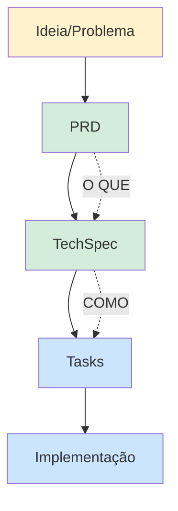

# Spec-Driven Development (SDD)

## O que é?

**S.D.D = Pensar antes de digitar.**

A IA funciona melhor com especificações do que com improviso. O mais importante não é mais o código, mas sim a **Spec**!

## Definição

| Termo | Significado | Tradução |
|-------|-------------|----------|
| **Spec** | Specification | Especificação |
| **Driven** | Guided/Directed | Guiado/Direcionado |
| **Development** | Building/Construction | Desenvolvimento/Construção |

> **Spec-Driven Development** = Desenvolvimento Guiado por Especificação

## Componentes do SDD

### PRD (Product Requirement Document)

O PRD define **O QUE** o produto vai ter:

- Funcionalidades esperadas
- Comportamentos do sistema
- Requisitos de negócio
- Critérios de aceitação

### TechSpec (Technical Specification)

A TechSpec define **COMO** será construído:

- Ferramentas e tecnologias (React, Next.js, PostgreSQL...)
- Arquitetura do sistema
- Contratos de API
- Modelo de dados
- Estratégia de testes

## Fluxo do SDD



## Por que usar SDD com IA?

1. **Contexto claro** - A IA entende exatamente o que você quer
2. **Menos retrabalho** - Especificar antes evita refazer depois
3. **Consistência** - O código gerado segue os padrões definidos
4. **Documentação** - Você já tem a documentação pronta
5. **Comunicação** - Especificações facilitam a colaboração

## Na prática

```
# 1. Defina O QUE (PRD)
"Quero um sistema de autenticação com login social"

# 2. Defina COMO (TechSpec)
"Use Next.js 15, NextAuth, PostgreSQL, Drizzle ORM"

# 3. Gere as Tasks
/create-task auth-system

# 4. Execute
/execute-task auth-system 01
```

---

> **Lembre-se**: Quanto mais você especificar para a IA o que você usa e o que você quer que ela faça e siga, melhor será o resultado!

