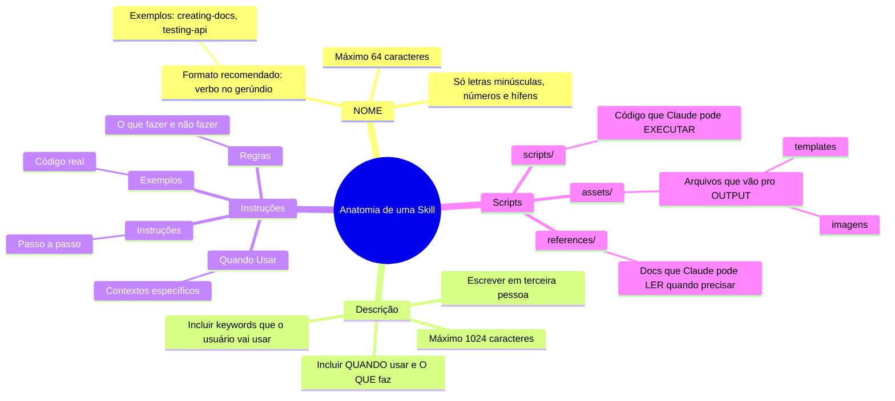

# Anatomia de uma Skill

Este documento descreve a estrutura e os componentes essenciais para a criação de uma Skill, conforme ilustrado no diagrama a seguir.

## 1. NOME

- **Máximo 64 caracteres**: O nome deve ser conciso e direto.
- **Apenas letras minúsculas, números e hífens**: Mantém consistência e compatibilidade.
- **Formato recomendado: verbo no gerúndio**: Facilita identificação da ação que a skill realiza.
  - *Exemplos:* `creating-docs`, `testing-api`

## 2. Descrição

- **Máximo 1024 caracteres**: Limite para manter descrições objetivas.
- **Escrever em terceira pessoa**: Tom objetivo e formal.
- **Incluir QUANDO usar e O QUE faz**: Contexto claro sobre aplicabilidade e funcionalidade.
- **Incluir keywords**: Palavras-chave que o usuário pode utilizar para encontrar/invocar a skill.

## 3. Instruções

A seção de instruções deve conter:

- **Quando Usar - Contextos específicos**: Define os cenários ou situações onde a skill é aplicável.
- **Instruções - Passo a passo**: Guia sequencial claro sobre como utilizar a skill.
- **Regras - O que fazer e não fazer**: Estabelece limites e boas práticas para interação.
- **Exemplos - Código real**: Ilustrações práticas para facilitar compreensão.

## 4. Scripts

Esta seção refere-se aos diretórios e tipos de arquivos associados à implementação da skill:

- **`scripts/`**: Código que Claude pode **EXECUTAR**.
- **`references/`**: Documentação que Claude pode **LER** quando precisar de contexto ou informações adicionais.
- **`assets/`**: Arquivos que serão parte do **OUTPUT** da skill, como templates ou imagens.

---

## Diagrama: Anatomia de uma Skill


## 5. Estrutura de Diretórios

### Diagrama Visual

```
┌─────────────────────────────────────────────────────────────────────────────┐
│                                                                             │
│   📁 minha-skill/                                                           │
│   │                                                                         │
│   ├── 📄 SKILL.md              # OBRIGATÓRIO - Instruções principais        │
│   │                                                                         │
│   ├── 📁 scripts/              # OPCIONAL - Código executável               │
│   │   │                        ┌────────────────────────────────────┐       │
│   │   ├── 📄 validate.py       │  Código que Claude pode EXECUTAR  │       │
│   │   │                        └────────────────────────────────────┘       │
│   │   └── 📄 generate.sh                                                    │
│   │                                                                         │
│   ├── 📁 references/           # OPCIONAL - Docs para contexto              │
│   │   │                        ┌────────────────────────────────────┐       │
│   │   ├── 📄 api-reference.md  │  Docs que Claude pode LER         │       │
│   │   │                        └────────────────────────────────────┘       │
│   │   └── 📄 examples.md                                                    │
│   │                                                                         │
│   └── 📁 assets/               # OPCIONAL - Templates, imagens              │
│       │                        ┌────────────────────────────────────┐       │
│       ├── 📄 template.pptx     │  Arquivos que vão pro OUTPUT      │       │
│       │                        └────────────────────────────────────┘       │
│       └── 📄 logo.png                                                       │
│                                                                             │
└─────────────────────────────────────────────────────────────────────────────┘
```

### Visão Simplificada

```
minha-skill/
│
├── SKILL.md ─────────────────── # OBRIGATÓRIO - Instruções principais
│
├── scripts/ ─────────────────── # OPCIONAL - Código executável
│   ├── validate.py
│   └── generate.sh
│
├── references/ ──────────────── # OPCIONAL - Docs para contexto
│   ├── api-reference.md
│   └── examples.md
│
└── assets/ ──────────────────── # OPCIONAL - Templates, imagens
    ├── template.pptx
    └── logo.png
```

### Legenda de Ícones

| Ícone | Significado |
|-------|-------------|
| 📁    | Diretório/Pasta |
| 📄    | Arquivo |

### Responsabilidades por Diretório

```
┌──────────────┬────────────────────────────────────────────────────────────┐
│  Diretório   │                      Responsabilidade                      │
├──────────────┼────────────────────────────────────────────────────────────┤
│  SKILL.md    │  Define nome, descrição, instruções, regras e exemplos     │
├──────────────┼────────────────────────────────────────────────────────────┤
│  scripts/    │  Scripts que Claude pode EXECUTAR (Python, Bash, etc.)     │
├──────────────┼────────────────────────────────────────────────────────────┤
│  references/ │  Documentação que Claude pode LER para obter contexto      │
├──────────────┼────────────────────────────────────────────────────────────┤
│  assets/     │  Templates e arquivos que serão parte do OUTPUT final      │
└──────────────┴────────────────────────────────────────────────────────────┘
```

### Fluxo de Uso

```
                    ┌─────────────────┐
                    │   SKILL.md      │
                    │  (Instruções)   │
                    └────────┬────────┘
                             │
                             ▼
        ┌────────────────────┼────────────────────┐
        │                    │                    │
        ▼                    ▼                    ▼
┌───────────────┐   ┌───────────────┐   ┌───────────────┐
│   scripts/    │   │  references/  │   │    assets/    │
│   EXECUTAR    │   │     LER       │   │    OUTPUT     │
└───────────────┘   └───────────────┘   └───────────────┘
        │                    │                    │
        └────────────────────┼────────────────────┘
                             │
                             ▼
                    ┌─────────────────┐
                    │    Resultado    │
                    │   da Skill      │
                    └─────────────────┘
```

---

## Exemplos (Few-Shot Prompting)

### Exemplo 1: Skill de Geração de Documentação

**Estrutura:**
```
creating-docs/
├── SKILL.md
├── scripts/
│   └── generate-readme.sh
├── references/
│   └── markdown-guide.md
└── assets/
    └── readme-template.md
```

**SKILL.md:**
```markdown
# creating-docs

## Descrição

Skill para geração automatizada de documentação de projetos. Utiliza quando o usuário precisa criar README, guias de uso ou documentação técnica. Analisa o código-fonte e gera documentação estruturada seguindo padrões estabelecidos.

**Keywords:** documentação, readme, docs, markdown, guia

## Quando Usar

- Usuário solicita criação de README
- Projeto novo precisa de documentação inicial
- Atualização de docs existentes
- Geração de guias de uso

## Instruções

1. Analisar estrutura do projeto
2. Identificar tecnologias e dependências
3. Ler scripts em `scripts/` se necessário
4. Usar template de `assets/readme-template.md`
5. Gerar documentação seguindo padrões do projeto

## Regras

✅ Sempre incluir seções: Instalação, Uso, Contribuição
✅ Usar badges relevantes para o projeto
✅ Manter tom profissional e objetivo
❌ Não inventar funcionalidades não existentes
❌ Não incluir informações sensíveis

## Exemplos

**Input:** "Crie um README para este projeto Node.js"

**Output:** README.md com estrutura completa incluindo instalação via npm, scripts disponíveis, exemplos de uso e licença.
```

---

### Exemplo 2: Skill de Validação de Código

**Estrutura:**
```
validating-code/
├── SKILL.md
├── scripts/
│   ├── lint-check.py
│   └── type-check.sh
└── references/
    ├── eslint-rules.md
    └── typescript-config.md
```

**SKILL.md:**
```markdown
# validating-code

## Descrição

Skill para validação e análise de qualidade de código. Utiliza quando o usuário precisa verificar padrões de código, executar linters ou validar tipos. Executa scripts de validação e reporta problemas encontrados.

**Keywords:** lint, validação, qualidade, eslint, typescript, check

## Quando Usar

- Antes de commits
- Revisão de código
- Verificação de padrões
- Análise de qualidade

## Instruções

1. Identificar linguagem/framework do código
2. Executar script apropriado de `scripts/`
3. Coletar output dos validadores
4. Formatar relatório de problemas
5. Sugerir correções quando possível

## Regras

✅ Executar todos os validadores relevantes
✅ Agrupar erros por arquivo
✅ Priorizar erros críticos
❌ Não auto-corrigir sem confirmação
❌ Não ignorar warnings silenciosamente

## Exemplos

**Input:** "Valide o código TypeScript deste projeto"

**Output:** Relatório com erros de tipo, violações de lint e sugestões de correção organizadas por severidade.
```

---

### Exemplo 3: Skill de Criação de Testes

**Estrutura:**
```
creating-tests/
├── SKILL.md
├── scripts/
│   └── run-tests.sh
├── references/
│   ├── jest-patterns.md
│   └── testing-best-practices.md
└── assets/
    ├── test-template.ts
    └── mock-template.ts
```

**SKILL.md:**
```markdown
# creating-tests

## Descrição

Skill para geração de testes automatizados. Utiliza quando o usuário precisa criar testes unitários, de integração ou e2e. Analisa o código existente e gera testes seguindo padrões do projeto.

**Keywords:** testes, jest, vitest, unitário, integração, mock, coverage

## Quando Usar

- Criar testes para código novo
- Aumentar cobertura de testes
- Gerar mocks e fixtures
- Refatorar testes existentes

## Instruções

1. Analisar código a ser testado
2. Identificar framework de testes do projeto
3. Consultar padrões em `references/`
4. Usar templates de `assets/`
5. Gerar testes com casos de sucesso e erro
6. Executar `scripts/run-tests.sh` para validar

## Regras

✅ Cobrir casos de sucesso e falha
✅ Usar describe/it com nomes descritivos
✅ Isolar dependências com mocks
✅ Seguir padrão AAA (Arrange, Act, Assert)
❌ Não criar testes que dependem de estado externo
❌ Não ignorar edge cases óbvios

## Exemplos

**Input:** "Crie testes para a função calculateTotal"

**Output:** Arquivo de teste com casos para valores válidos, zero, negativos, arrays vazios e tipos inválidos.
```

---

## Template Base para Nova Skill

```markdown
# nome-da-skill

## Descrição

[Máximo 1024 caracteres. Descreva em terceira pessoa O QUE a skill faz e QUANDO usar. Inclua keywords relevantes.]

**Keywords:** [palavra1, palavra2, palavra3]

## Quando Usar

- [Contexto específico 1]
- [Contexto específico 2]
- [Contexto específico 3]

## Instruções

1. [Passo 1]
2. [Passo 2]
3. [Passo 3]
4. [Passo 4]

## Regras

✅ [O que fazer 1]
✅ [O que fazer 2]
❌ [O que não fazer 1]
❌ [O que não fazer 2]

## Exemplos

**Input:** "[Exemplo de entrada do usuário]"

**Output:** [Descrição do resultado esperado]
```

---

## Checklist de Criação

- [ ] Nome segue formato: letras minúsculas, números, hífens (máx 64 chars)
- [ ] Descrição clara e objetiva (máx 1024 chars)
- [ ] Keywords relevantes incluídas
- [ ] Seção "Quando Usar" com contextos específicos
- [ ] Instruções em passo a passo
- [ ] Regras de "fazer" e "não fazer"
- [ ] Pelo menos um exemplo prático
- [ ] SKILL.md na raiz da pasta
- [ ] Scripts em `scripts/` (se necessário)
- [ ] Referências em `references/` (se necessário)
- [ ] Assets em `assets/` (se necessário)

## Base do projeto é formatada para criar algo com:

    