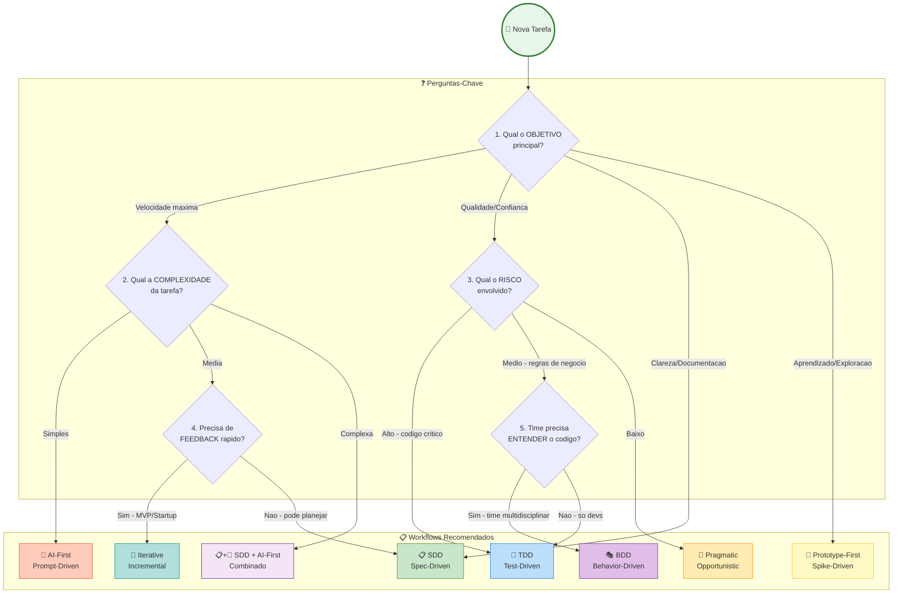
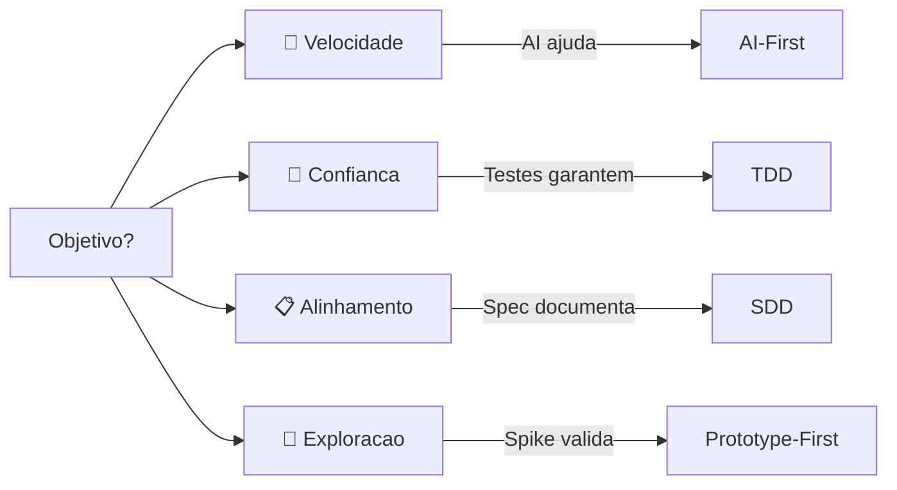
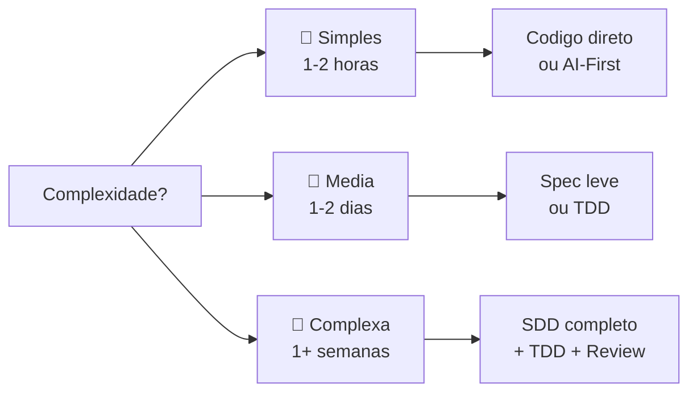
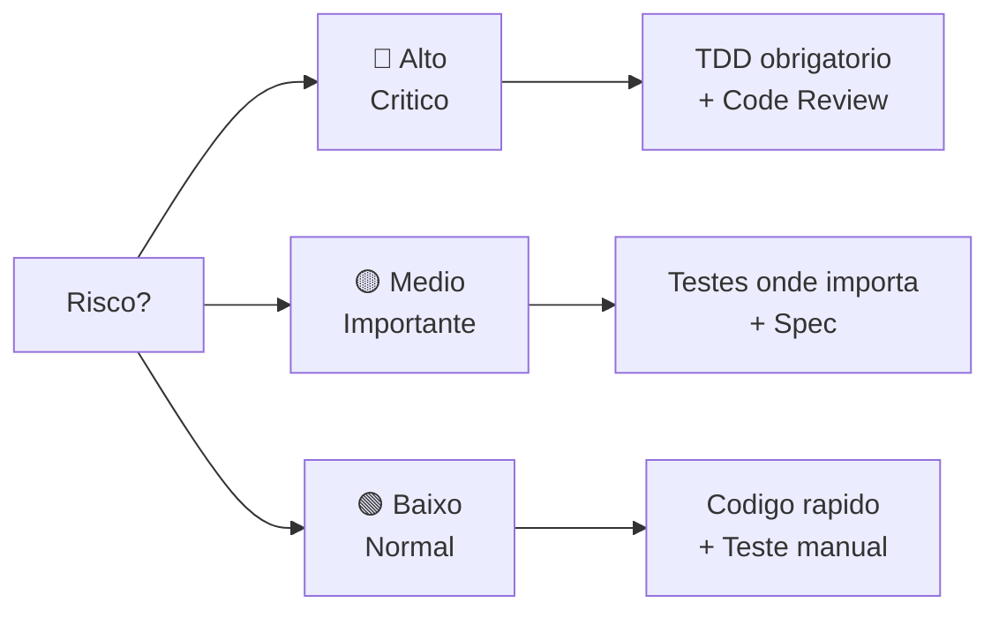
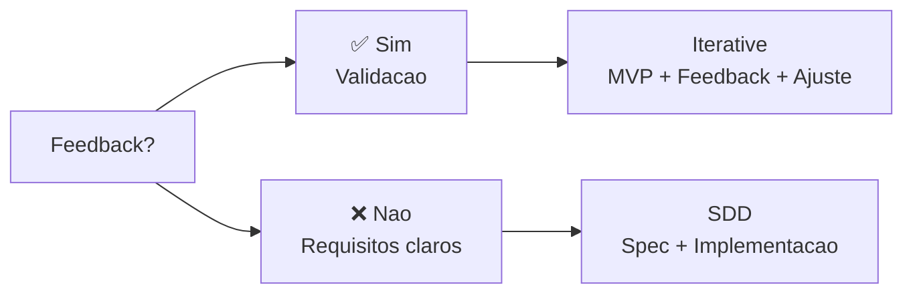
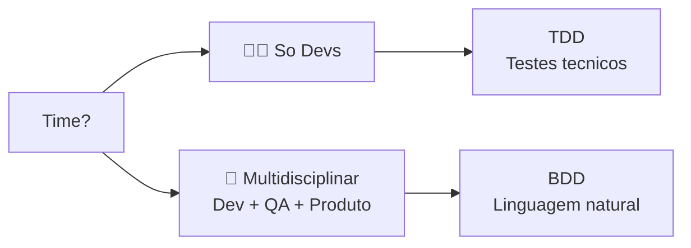
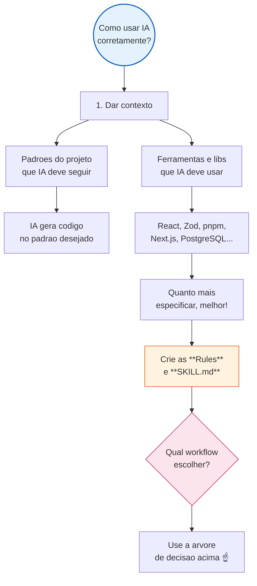

# 🎯 Como Escolher o Workflow Certo

> **"Nao existe workflow perfeito. Existe workflow certo para o contexto."**

Este guia te ajuda a escolher o workflow ideal para cada tarefa usando um **fluxo cognitivo de decisao**.

---

## Arvore de Decisao

Responda as perguntas abaixo para encontrar seu workflow:



---

## Matriz de Decisao Rapida

### Por Objetivo

| Se voce quer... | Use este workflow |
|-----------------|-------------------|
| 🚀 **Desenvolver rapido** | [AI-First](workflows/ai-first-prompt-driven.md) |
| 📋 **Alinhar com time** | [SDD](workflows/spec-driven-development.md) |
| 🧪 **Codigo sem bugs** | [TDD](workflows/test-driven-development.md) |
| 💬 **Time entender codigo** | [BDD](workflows/behavior-driven-development.md) |
| 🔬 **Explorar tecnologia nova** | [Prototype-First](workflows/prototype-first-spike-driven.md) |
| 🔄 **Validar com usuarios** | [Iterative](workflows/iterative-incremental-development.md) |
| 🌳 **Deploy frequente** | [Trunk-Based](workflows/trunk-based-development.md) |
| 🎯 **Flexibilidade total** | [Pragmatic](workflows/pragmatic-opportunistic.md) |

### Por Tipo de Projeto

| Tipo de Projeto | Workflow Principal | Complementos |
|-----------------|-------------------|--------------|
| **MVP/Startup** | Iterative | + AI-First + Pragmatic |
| **Backend Critico** | TDD | + SDD + Trunk-Based |
| **Frontend Rapido** | AI-First | + Iterative |
| **API Publica** | SDD | + TDD + BDD |
| **Tecnologia Nova** | Prototype-First | + SDD |
| **Time Grande** | SDD | + Trunk-Based + BDD |
| **Solo Dev** | Pragmatic | + AI-First |

### Por Situacao

| Situacao | Melhor Abordagem |
|----------|-----------------|
| Bug critico em producao | Fix rapido + teste manual → Pragmatic |
| Feature nova simples | Codigo direto + testes depois → AI-First |
| Feature nova complexa | Spec + codigo + testes → SDD + TDD |
| Tecnologia desconhecida | Spike primeiro → Prototype-First |
| Logica de negocio | Teste antes → TDD |
| Time precisa alinhar | Spec primeiro → SDD |
| Validar ideia rapido | MVP + feedback → Iterative |
| Deploy continuo | Branches curtas → Trunk-Based |

---

## Fluxo Cognitivo Detalhado

### Pergunta 1: Qual o objetivo principal?



**Pergunte-se:**
- Preciso entregar rapido? → **Velocidade**
- O codigo nao pode ter bugs? → **Confianca**
- O time precisa entender? → **Alinhamento**
- Nao sei se vai funcionar? → **Exploracao**

---

### Pergunta 2: Qual a complexidade?



**Indicadores de complexidade:**
- **Simples**: Uma funcao, um componente, bugfix
- **Media**: Uma feature, integracao, refatoracao
- **Complexa**: Sistema novo, arquitetura, multiplos servicos

---

### Pergunta 3: Qual o risco?



**Codigo de alto risco:**
- Pagamentos, autenticacao, dados sensiveis
- Calculos financeiros, regras de negocio criticas
- Integracoes externas, APIs publicas

---

### Pergunta 4: Preciso de feedback rapido?



**Quando feedback e critico:**
- Produto novo, startup, MVP
- Requisitos incertos
- Usuario final e desconhecido

---

### Pergunta 5: Time precisa entender o codigo?



**BDD e ideal quando:**
- QA/Produto precisa validar specs
- Regras de negocio complexas
- Documentacao viva necessaria

---

## Como Usar IA de Forma Correta



### Checklist para IA Eficiente

- [ ] **Contexto claro** - IA sabe o que o projeto faz
- [ ] **Padroes definidos** - Rules/.cursor/rules/
- [ ] **Stack especificada** - Libs, frameworks, versoes
- [ ] **Exemplos disponiveis** - Few-shot patterns
- [ ] **Workflow escolhido** - Sabe o processo a seguir

---

## Combinando Workflows

### Principio Fundamental

> **Nenhum time usa um workflow puro. A arte esta em combinar.**

### Formula do Workflow Moderno

```
┌─────────────────────────────────────────────────────────────┐
│                   WORKFLOW MODERNO EFICAZ                    │
├─────────────────────────────────────────────────────────────┤
│                                                              │
│   📋 SDD          →  Alinhamento (o que fazer)               │
│   🧪 TDD          →  Confianca (funciona certo)              │
│   🔄 Iterative    →  Feedback (usuarios validam)             │
│   🤖 AI-First     →  Velocidade (IA acelera)                 │
│   🌳 Trunk-Based  →  Deploy (entrega continua)               │
│                                                              │
│   =  🚀 Desenvolvimento Eficiente                            │
│                                                              │
└─────────────────────────────────────────────────────────────┘
```

### Exemplos de Combinacao

#### MVP Rapido
```
Iterative (validacao) + AI-First (velocidade) + Pragmatic (flexibilidade)
```

#### Backend Critico
```
SDD (clareza) + TDD (confianca) + Trunk-Based (deploy)
```

#### Time Grande
```
SDD (alinhamento) + BDD (comunicacao) + Trunk-Based (integracao)
```

---

## Proximos Passos

1. **Identifique sua tarefa** - O que voce precisa fazer?
2. **Responda as perguntas** - Use a arvore de decisao
3. **Escolha o workflow** - Principal + complementos
4. **Leia a documentacao** - Do workflow escolhido
5. **Configure o ambiente** - Rules, prompts, templates
6. **Execute** - Aplique o workflow na pratica

---

## Links Uteis

- 📚 [Mapa Completo de Workflows](workflows/work-flows.md)
- 📋 [SDD - Spec-Driven](workflows/spec-driven-development.md)
- 🧪 [TDD - Test-Driven](workflows/test-driven-development.md)
- 🎭 [BDD - Behavior-Driven](workflows/behavior-driven-development.md)
- 🤖 [AI-First](workflows/ai-first-prompt-driven.md)
- 🔬 [Prototype-First](workflows/prototype-first-spike-driven.md)
- 🔄 [Iterative](workflows/iterative-incremental-development.md)
- 🌳 [Trunk-Based](workflows/trunk-based-development.md)
- 🎯 [Pragmatic](workflows/pragmatic-opportunistic.md)

---

**Ultima Atualizacao**: 2024
