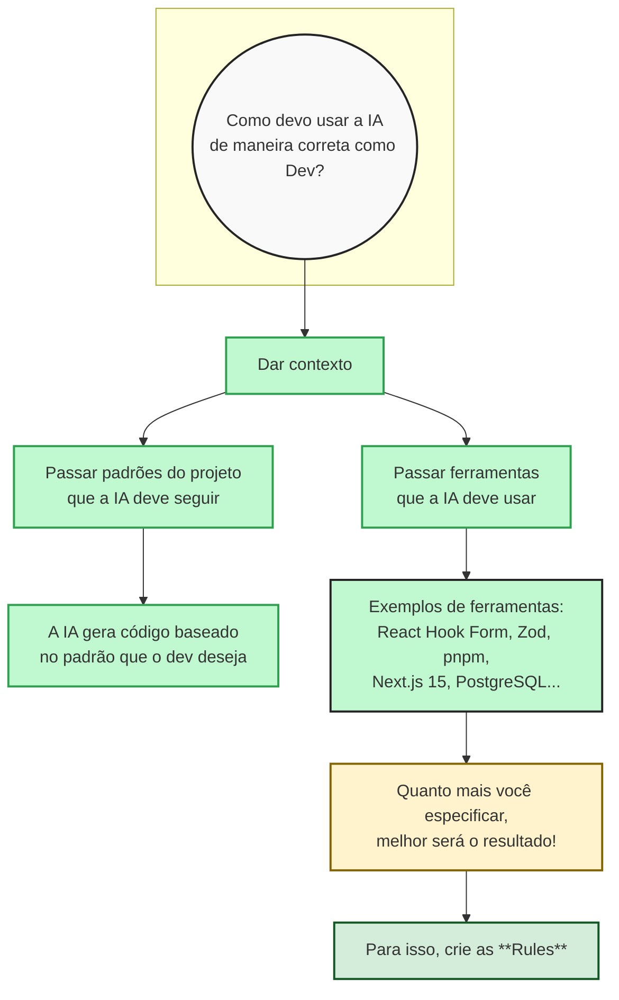

# Como usar IA de maneira correta como Dev

## Fluxo de Trabalho

## Resumo

A chave para usar IA de forma eficiente como desenvolvedor é **dar contexto**:

1. **Padrões do projeto** - Informe à IA os padrões de código que seu projeto deve seguir
2. **Ferramentas e tecnologias** - Especifique quais ferramentas a IA deve usar (frameworks, libs, etc.)
3. **Crie Rules** - Configure regras no seu ambiente para que a IA sempre siga essas diretrizes
4. **Crie ou pegue SKIIL.md** - 