# 🗺️ Mapa de Workflows de Desenvolvimento

> **"Workflow nao e religiao. E ferramenta cognitiva."**

Este documento apresenta diferentes workflows de desenvolvimento como **oculos diferentes para olhar o mesmo problema**: alguns priorizam clareza, outros velocidade, outros aprendizado, outros IA.

> 🎯 **Nao sabe qual escolher?** Veja o [Guia de Escolha](../workflow.md) com arvore de decisao interativa.

---

## 📊 Visao Geral Rapida


### Tabela Comparativa

| Workflow | Foco | Ideal Para | Velocidade | Confianca |
|----------|------|------------|------------|-----------|
| [📋 SDD](#1-spec-driven-development-sdd) | Especificacao | Times, projetos grandes | ⭐⭐⭐ | ⭐⭐⭐⭐ |
| [🧪 TDD](#2-test-driven-development-tdd) | Testes | Codigo critico | ⭐⭐ | ⭐⭐⭐⭐⭐ |
| [🎭 BDD](#3-behavior-driven-development-bdd) | Comportamento | Times multidisciplinares | ⭐⭐ | ⭐⭐⭐⭐ |
| [🌳 Trunk-Based](#4-trunk-based-development) | Integracao | CI/CD, deploy continuo | ⭐⭐⭐⭐ | ⭐⭐⭐⭐ |
| [🔄 Iterative](#5-iterative--incremental-development) | Feedback | MVPs, startups | ⭐⭐⭐⭐ | ⭐⭐⭐ |
| [🔬 Prototype-First](#6-prototype-first--spike-driven) | Exploracao | Tecnologia nova | ⭐⭐⭐⭐⭐ | ⭐⭐ |
| [🤖 AI-First](#7-ai-first--prompt-driven-workflow) | Velocidade | Dev assistido por IA | ⭐⭐⭐⭐⭐ | ⭐⭐⭐ |
| [🎯 Pragmatic](#8-pragmatic--opportunistic-workflow) | Flexibilidade | Solo dev, prototipos | ⭐⭐⭐⭐⭐ | ⭐⭐⭐ |

---

## 📚 Indice

1. [Spec-Driven Development (SDD)](#1-spec-driven-development-sdd)
2. [Test-Driven Development (TDD)](#2-test-driven-development-tdd)
3. [Behavior-Driven Development (BDD)](#3-behavior-driven-development-bdd)
4. [Trunk-Based Development](#4-trunk-based-development)
5. [Iterative / Incremental Development](#5-iterative--incremental-development)
6. [Prototype-First / Spike-Driven](#6-prototype-first--spike-driven)
7. [AI-First / Prompt-Driven Workflow](#7-ai-first--prompt-driven-workflow)
8. [Pragmatic / Opportunistic Workflow](#8-pragmatic--opportunistic-workflow)

---

## 1. Spec-Driven Development (SDD)

> **"Especificacao primeiro, codigo depois."**

### Conceito

Escreva **o que o sistema deve fazer** antes de escrever **como ele faz**.


### Ferramentas Comuns

- Markdown specs
- ADRs (Architecture Decision Records)
- OpenAPI/Swagger
- PlantUML/Mermaid

### Quando Usar

| ✅ Use quando | ❌ Evite quando |
|--------------|----------------|
| Projetos medios/grandes | Prototipos muito rapidos |
| Integracao com IA | Projetos que mudam constantemente |
| Software que vai crescer | Velocidade > clareza |
| Times que precisam de alinhamento | Projetos solo muito pequenos |

### Combinacoes Comuns

- **SDD + AI-First**: IA implementa baseado nas specs
- **SDD + TDD**: Spec define, teste valida
- **SDD + Trunk-Based**: Alinhamento + deploy continuo

📄 **[Ver guia completo](./spec-driven-development.md)**

---

## 2. Test-Driven Development (TDD)

> **"O codigo nasce quebrando."**

### Conceito

Fluxo: **🔴 Teste falha → 🟢 Codigo minimo → 🔵 Refatora**

O teste e a spec executavel.

```mermaid
flowchart LR
    A[🔴 Teste] --> B[🟢 Codigo]
    B --> C[🔵 Refatora]
    C --> A
```



### Forcas e Fraquezas

| ✅ Forcas | ⚠️ Fraquezas |
|----------|-------------|
| Confianca absoluta | Mais lento no inicio |
| Codigo mais modular | Pode virar "teste de implementacao" |
| Excelente para logica critica | Dificil para UI/UX |

### Quando Usar

| ✅ Use quando | ❌ Evite quando |
|--------------|----------------|
| Backends e APIs | Prototipos muito rapidos |
| Regras de negocio | UI/UX (testes dificeis) |
| Bibliotecas e utilitarios | Velocidade inicial critica |
| Codigo critico (seguranca, financeiro) | Codigo que muda constantemente |

### Combinacoes Comuns

- **TDD + SDD**: Spec define comportamento, teste valida
- **TDD + BDD**: TDD para codigo, BDD para comportamento
- **TDD + Trunk-Based**: Testes garantem main estavel

📄 **[Ver guia completo](./test-driven-development.md)**

---

## 3. Behavior-Driven Development (BDD)

> **"Um primo mais 'humano' do TDD."**

### Conceito

A spec e escrita em **linguagem quase natural**:

```gherkin
Dado que o usuario esta logado
Quando ele clica em pagar
Entao o sistema confirma o pagamento
```

### Foco

- Comportamento do sistema
- Comunicacao com produto/negocio
- Documentacao viva

### Quando Usar

| ✅ Use quando | ❌ Evite quando |
|--------------|----------------|
| Times multidisciplinares | Codigo muito tecnico |
| Produtos com regras claras | Velocidade > clareza |
| Produto precisa entender codigo | Projetos muito pequenos |

### Combinacoes Comuns

- **BDD + TDD**: BDD para comportamento, TDD para codigo
- **BDD + SDD**: BDD como parte da spec
- **BDD + Trunk-Based**: Comportamento + deploy continuo

📄 **[Ver guia completo](./behavior-driven-development.md)**

---

## 4. Trunk-Based Development

> **"Workflow de branching, nao de escrita."**

### Conceito

- Poucas branches (vida curta, < 1 dia)
- Commits pequenos e frequentes
- Integracao continua real
- Feature flags para codigo incompleto


### Forcas e Fraquezas

| ✅ Forcas | ⚠️ Fraquezas |
|----------|-------------|
| Menos conflito | Requer disciplina |
| Deploys mais frequentes | Times precisam ser maduros |
| Excelente com CI/CD | Precisa de feature flags |

### Quando Usar

| ✅ Use quando | ❌ Evite quando |
|--------------|----------------|
| Times maduros | Times muito grandes sem flags |
| Deploy continuo | Releases sao raras |
| Produtos vivos | Muitos devs iniciantes |

### Combinacoes Comuns

- **Trunk-Based + TDD**: Testes garantem main estavel
- **Trunk-Based + SDD**: Alinhamento + integracao rapida
- **Trunk-Based + AI-First**: Velocidade de codigo + deploy

📄 **[Ver guia completo](./trunk-based-development.md)**

---

## 5. Iterative / Incremental Development

> **"Construir em fatias verticais, nao tudo de uma vez."**

### Conceito


E a base de quase todo metodo agil moderno.

### Quando Usar

| ✅ Use quando | ❌ Evite quando |
|--------------|----------------|
| Produtos em validacao | Requisitos muito fixos |
| MVPs e startups | Spec completa obrigatoria |
| Feedback rapido e critico | Sistemas criticos imutaveis |

### Combinacoes Comuns

- **Iterative + AI-First**: IA acelera cada iteracao
- **Iterative + SDD**: Spec evolui com feedback
- **Iterative + Pragmatic**: Flexibilidade maxima

📄 **[Ver guia completo](./iterative-incremental-development.md)**

---

## 6. Prototype-First / Spike-Driven

> **"Nao se comprometa com o codigo."**

### Conceito

Voce explora:
- APIs e integracoes
- Performance e limites
- Viabilidade tecnica

Depois joga fora (ou nao 👀).

### Quando Usar

| ✅ Use quando | ❌ Evite quando |
|--------------|----------------|
| Tecnologia nova | Ja conhece bem a tecnologia |
| Alto risco tecnico | Risco e baixo |
| Decisoes arquiteturais | Tempo e critico sem alternativas |
| Validacao de conceito | Features simples e diretas |

### Combinacoes Comuns

- **Spike + SDD**: Spike valida, SDD documenta
- **Spike + TDD**: Spike explora, TDD implementa
- **Spike + Iterative**: Exploracao em cada iteracao

📄 **[Ver guia completo](./prototype-first-spike-driven.md)**

---

## 7. AI-First / Prompt-Driven Workflow

> **"IA como colaborador, nao como magica."**

### Conceito


E uma evolucao natural do SDD, mas com **IA como colaborador**.

### Ferramentas

- Rules (.cursor/rules/)
- Sub-agents especializados
- Tech specs
- Few-shot prompting

### Quando Usar

| ✅ Use quando | ❌ Evite quando |
|--------------|----------------|
| Hoje. Literalmente hoje | Codigo critico sem revisao |
| IA integrada (Cursor, Copilot) | Sem tempo para revisar codigo |
| Velocidade + qualidade | Padroes nao documentados |

### Combinacoes Comuns

- **AI-First + SDD**: Specs alimentam a IA
- **AI-First + TDD**: IA gera testes
- **AI-First + Iterative**: Acelera cada iteracao

📄 **[Ver guia completo](./ai-first-prompt-driven.md)**

---

## 8. Pragmatic / Opportunistic Workflow

> **"O 'dev pragmatico' em estado puro."**

### Conceito

Voce alterna entre:
- Spec quando precisa
- Codigo rapido quando da
- Teste quando doi
- Refatoracao quando fede

Nao e bagunca — e **consciencia situacional**.

### Quando Usar

| ✅ Use quando | ❌ Evite quando |
|--------------|----------------|
| Projetos pequenos | Times grandes |
| Solo dev | Projetos criticos sem processo |
| Prototipos rapidos | Consistencia e essencial |
| Contexto muda rapido | Devs iniciantes |

### Combinacoes Comuns

O Pragmatic **integra** todos os outros conforme necessidade:

```
Pragmatic Workflow
  ├── Usa SDD quando precisa alinhar
  ├── Usa TDD quando precisa confianca
  ├── Usa BDD quando precisa comunicacao
  ├── Usa AI-First quando precisa velocidade
  └── Usa Spike quando precisa explorar
```

📄 **[Ver guia completo](./pragmatic-opportunistic.md)**

---

## 🎯 A Verdade Incomoda (e Libertadora)

**Nenhum time usa um workflow puro.**

### O que Times Bons Fazem

```mermaid
flowchart TD
    A[Times Bons] --> B[✅ Spec para alinhar]
    A --> C[✅ Teste onde importa]
    A --> D[✅ Iteracao curta]
    A --> E[✅ IA como alavanca]
    A --> F[✅ Pragmatismo como cola]
```



### Workflow Hibrido Ideal

```
┌─────────────────────────────────────────────────────────────┐
│                   WORKFLOW MODERNO EFICAZ                    │
├─────────────────────────────────────────────────────────────┤
│                                                              │
│   📋 SDD (alinhamento)                                       │
│     + 🧪 TDD (confianca onde importa)                        │
│       + 🔄 Iteracao curta (feedback rapido)                  │
│         + 🤖 AI-First (velocidade)                           │
│           + 🌳 Trunk-Based (deploy continuo)                 │
│                                                              │
│   = 🚀 Desenvolvimento Moderno Eficaz                        │
│                                                              │
└─────────────────────────────────────────────────────────────┘
```

---

## 🗺️ Mapa de Decisao: Qual Workflow Usar?

> 🎯 **Quer um guia mais detalhado?** Veja [Como Escolher o Workflow](../workflow.md)

### Por Tipo de Projeto

| Tipo de Projeto | Workflow Recomendado | Combinacao |
|----------------|---------------------|------------|
| **MVP/Startup** | Iterative + Pragmatic | Rapido, validacao constante |
| **Backend Critico** | TDD + SDD | Confianca + Alinhamento |
| **Frontend Rapido** | AI-First + Pragmatic | Velocidade + Flexibilidade |
| **Produto Estabelecido** | BDD + Trunk-Based | Comportamento + Deploy continuo |
| **Tecnologia Nova** | Prototype-First + SDD | Exploracao + Documentacao |
| **Time Grande** | SDD + Trunk-Based | Alinhamento + Integracao |

### Por Objetivo

| Objetivo | Workflows |
|----------|-----------|
| **Clareza** | SDD, BDD |
| **Velocidade** | AI-First, Pragmatic |
| **Confianca** | TDD, BDD |
| **Aprendizado** | Prototype-First, Iterative |
| **Escalabilidade** | SDD, Trunk-Based |

---

## 📖 Proximos Passos

1. 🎯 [Escolha um workflow](../workflow.md) baseado no seu contexto
2. 📄 Leia a documentacao completa do workflow escolhido
3. 🔧 Configure Rules e templates para seu projeto
4. 🚀 Aplique o workflow na pratica
5. 🔄 Adapte conforme necessario

---

**Ultima Atualizacao**: Fevereiro 2026
